# Часть A. Установка и переключение домена

## 1. Composer и PHP-расширения

Composer установлен глобально, добавлены необходимые расширения PHP для Laravel.

## 2. Переезд папок

Старая папка переименована в `/var/www/boardy-legacy`, а новый Laravel-проект успешно создан в `/var/www/boardy`.

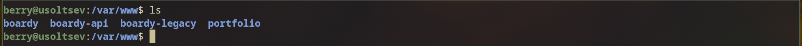
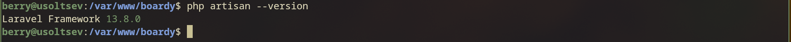

## 3. Структура Laravel

Изучена структура созданного проекта: `app/` — бизнес-логика и модели, `routes/` — маршрутизация запросов, `resources/views/` — фронтенд-шаблоны, `database/` — миграции и сидеры, `public/` — точка входа и публичная статика.

- Почему document_root nginx должен указывать на public/, а не на /var/www/boardy/? Что плохого случится, если указать на корень?

Указание на папку `public/` изолирует системные файлы проекта, иначе злоумышленники смогут получить прямой доступ к конфигурации с паролями (например, файлу `.env`).

## 4. Nginx-конфиг

Конфигурация Nginx обновлена, корень сайта изменён на `public/`, добавлен механизм `try_files` для ЧПУ.

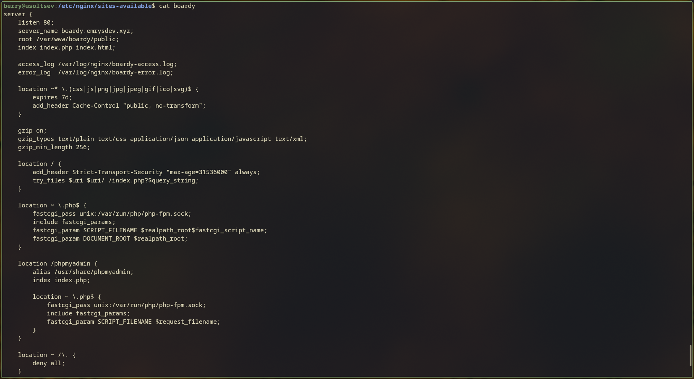
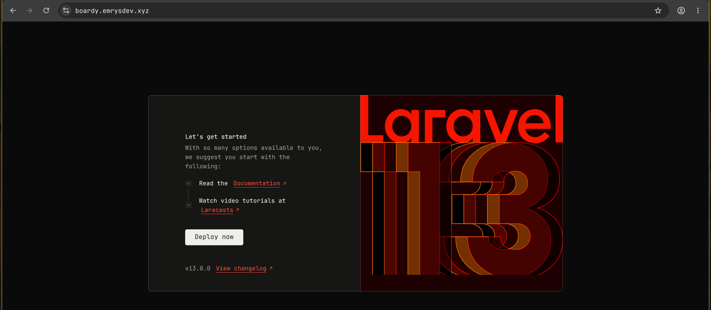

- Что делает try_files $uri $uri/ /index.php?$query_string? Что произойдёт без этой строки при заходе на /posts/3?

Эта директива перенаправляет все запросы к несуществующим файлам на единую точку входа `index.php`, без неё при попытке открыть `/posts/3` веб-сервер вернет ошибку 404.

# Часть B. БД, миграции, сидер

## 5. Создание БД boardy_main

Создана новая база данных `boardy_main` с кодировкой utf8mb4 и выданы права пользователю `boardy`.

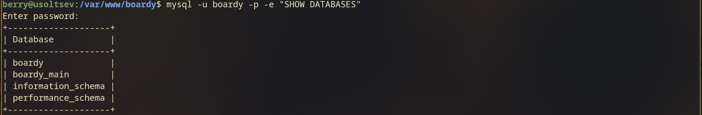

- Зачем мы создаём новую БД, а не подгоняем старую под Laravel? Что в схеме старой БД мешает?

Новая база создается с нуля из-за строгих соглашений Laravel об именовании таблиц и обязательных системных полей (таких как `created_at` и `updated_at`), которым старая архитектура не соответствует.

## 6. Подключение Laravel к БД

Настройки в файле `.env` обновлены для подключения к базе `boardy_main`.

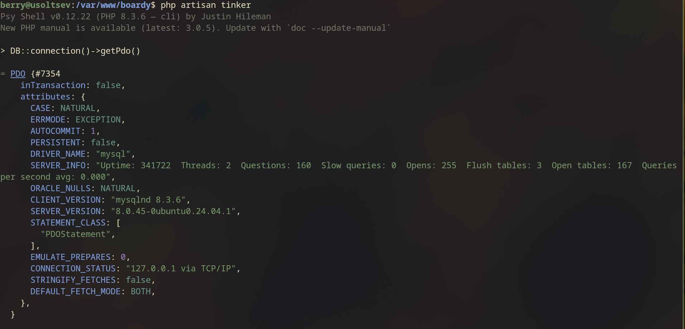

## 7. Миграции posts и comments

Созданы и успешно применены миграции для создания таблиц постов и комментариев.

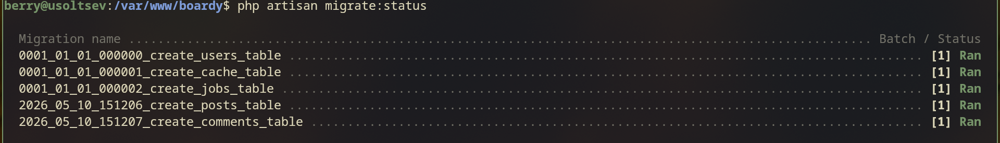
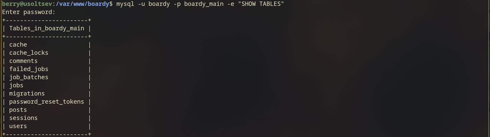

## 8. Модели со связями

Созданы модели `Post` и `Comment`, а также прописаны ORM-связи в существующей модели `User`.

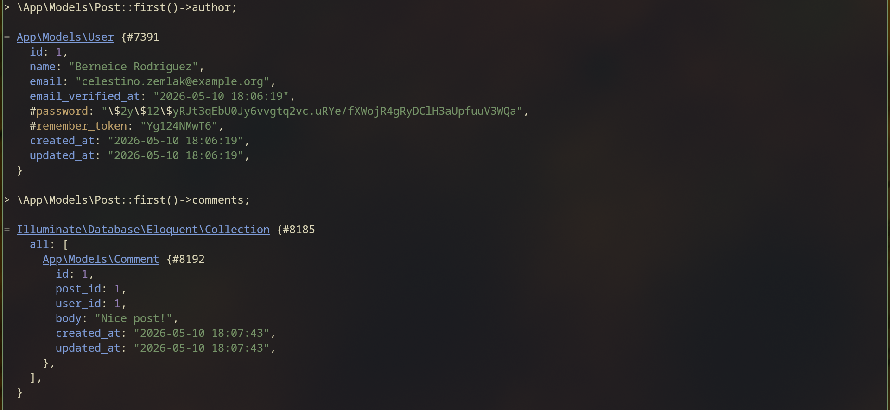

## 9. Сидер

Написаны фабрики `PostFactory` и `CommentFactory`, сидер настроен и успешно запущен для наполнения базы тестовыми данными.

# Часть C. CRUD постов и комментариев

## 10. Маршруты

Настроен ресурсный контроллер для постов и защищённый POST-маршрут для сохранения комментариев.

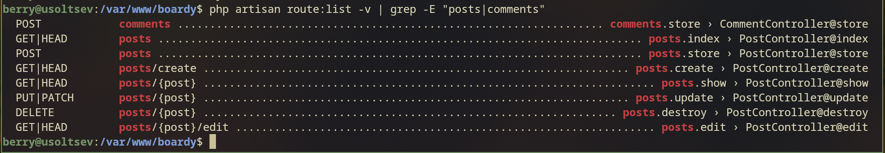

## 11. Лента постов

Реализован метод `index` и соответствующий Blade-шаблон для вывода ленты из 10 постов с пагинацией.

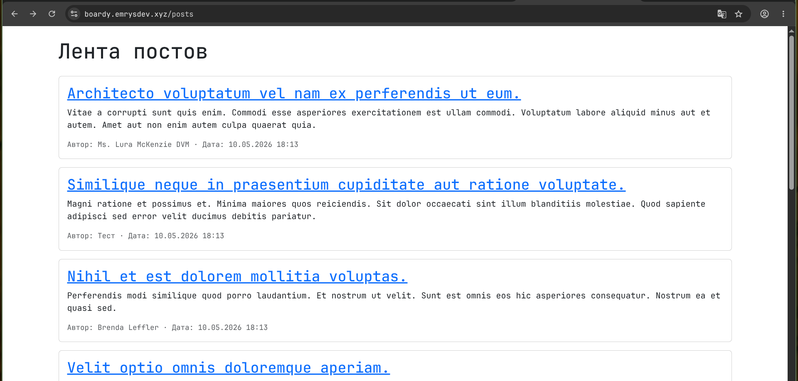

## 12. Страница поста с комментариями

Реализована страница детального просмотра поста, выводящая сам пост, список комментариев и форму для их добавления.

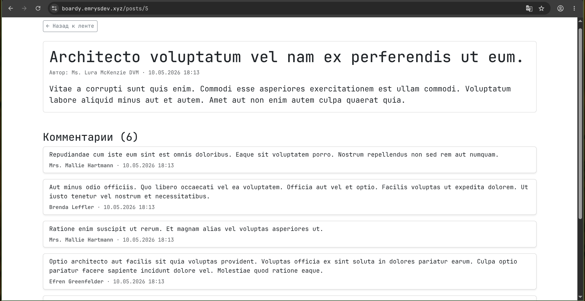

## 13. Создание поста

Реализованы методы создания и сохранения нового поста, добавлена форма с валидацией полей.

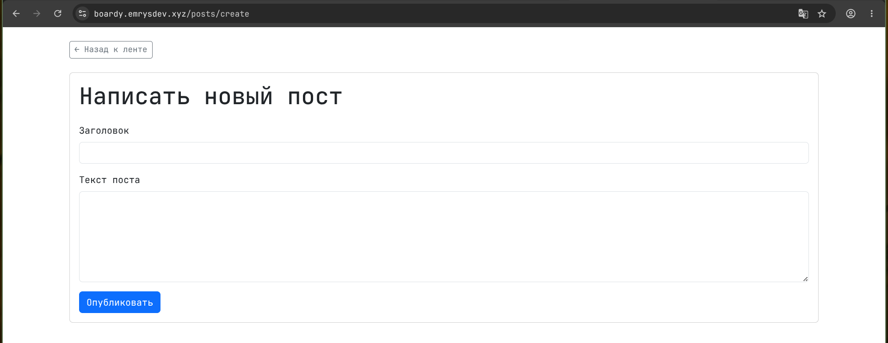
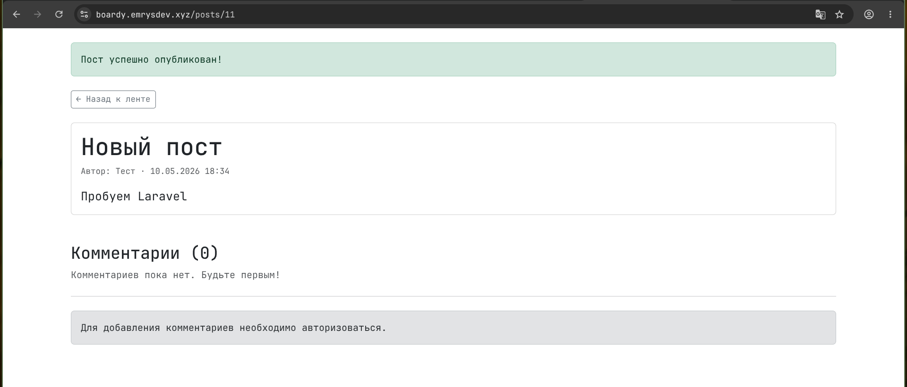

## 14. Policy и редактирование

Создана политика `PostPolicy`, благодаря которой редактировать и удалять посты теперь может только их автор.

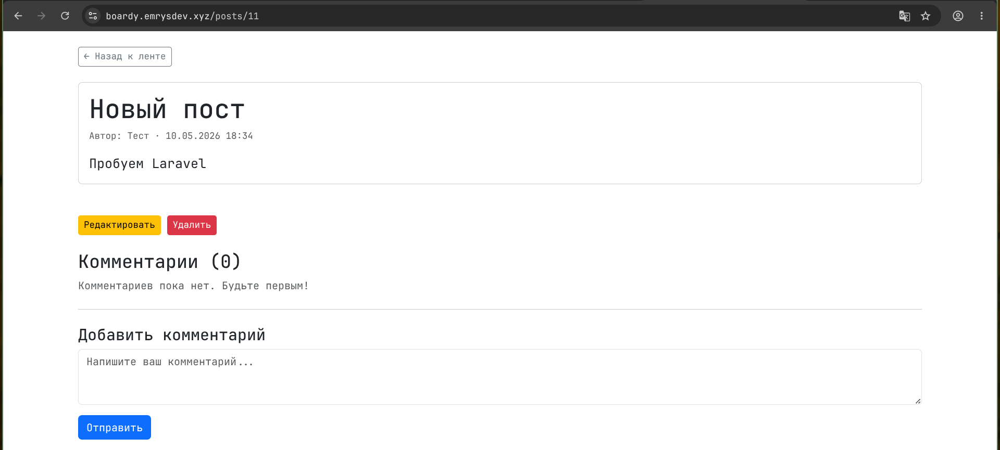

- Сравните Policy с тем, как авторизация была реализована в Lab10–11 (на чистом PHP). Сколько строк кода ушло на тот же эффект?

Использование Policy позволило заменить десятки строк однообразных проверок вроде `if ($user_id !== $post_author_id)` на один лаконичный вызов `$this->authorize()`.

## 15. Удаление поста

Реализован метод удаления поста с предварительной проверкой прав пользователя через Policy.

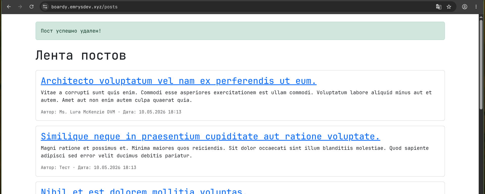

## 16. Комментарий через Blade

Реализован метод сохранения комментария и его немедленное отображение на странице поста.

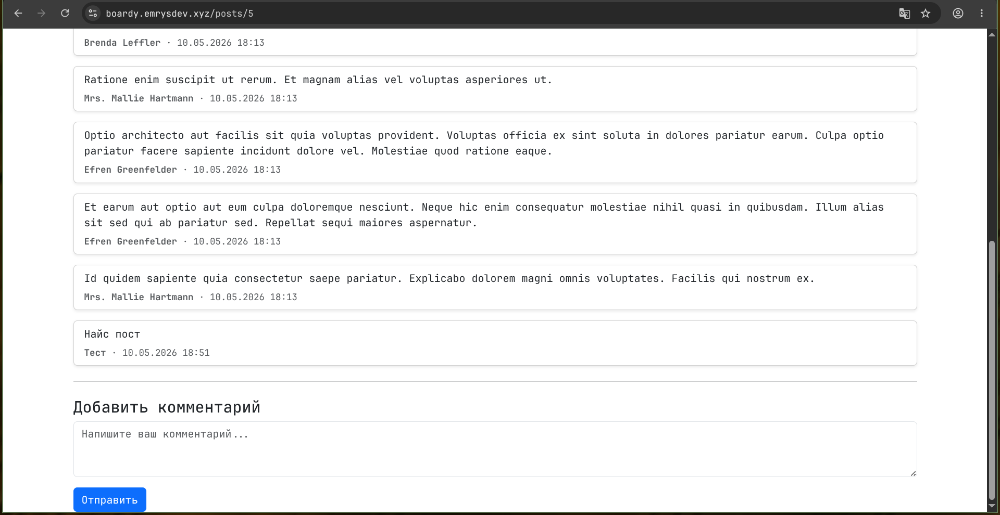

# Часть D. Breeze + Socialite

## 17. Установка Breeze

Пакет Laravel Breeze установлен, миграции выполнены, фронтенд успешно собран.

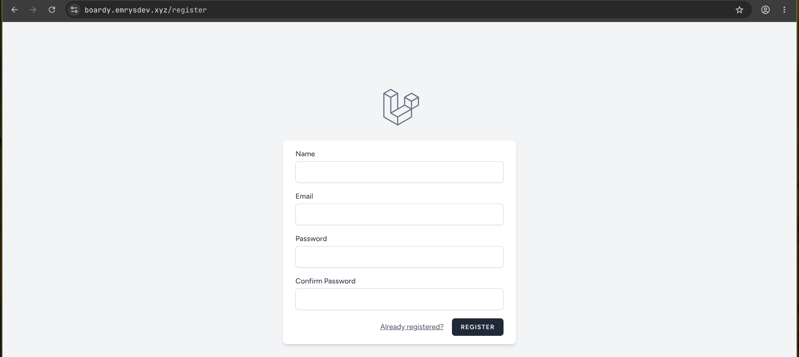
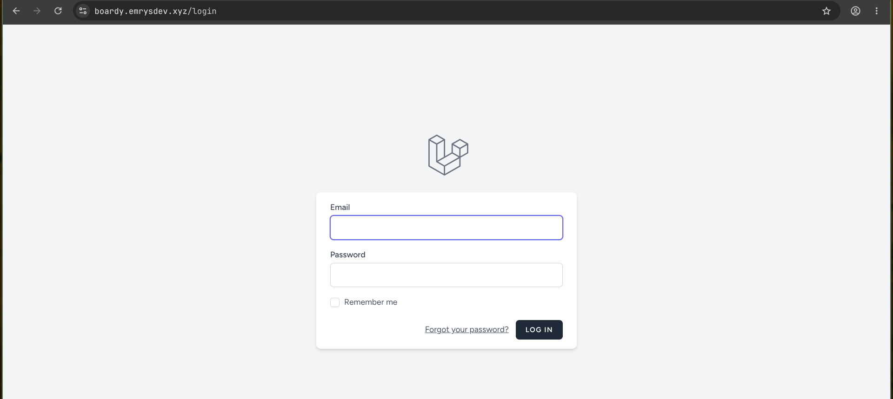

## 18. Регистрация и вход

Проверена корректная работа стандартной регистрации, выхода из системы и повторного входа.

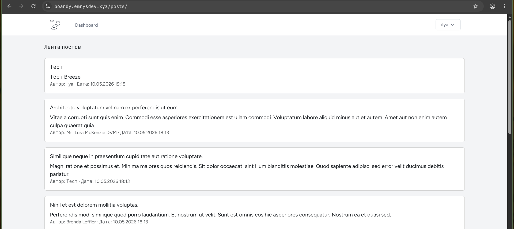

## 19. GitHub OAuth-приложение

Создано OAuth-приложение на платформе GitHub с настроенным Callback URL.

## 20. Socialite

Пакет Laravel Socialite установлен, добавлено поле `github_id` в базу, логика авторизации привязана к кнопке на странице входа.

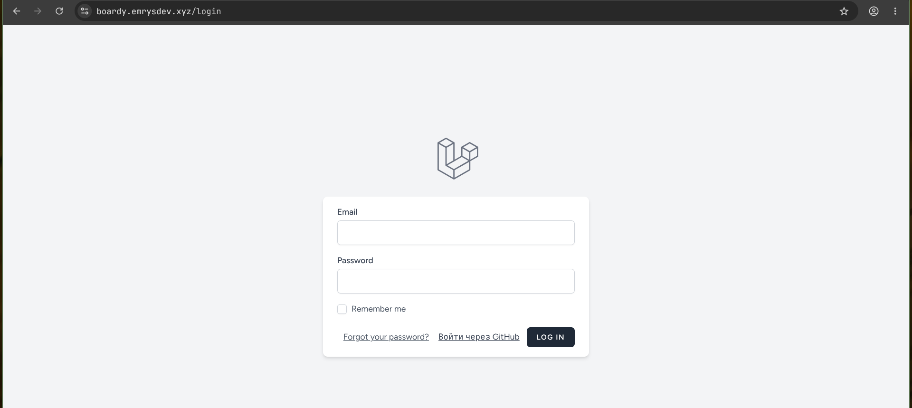

## 21. Полный OAuth flow

Успешно реализован полный цикл входа через GitHub, начиная от клика по кнопке до автоматической авторизации на сайте.

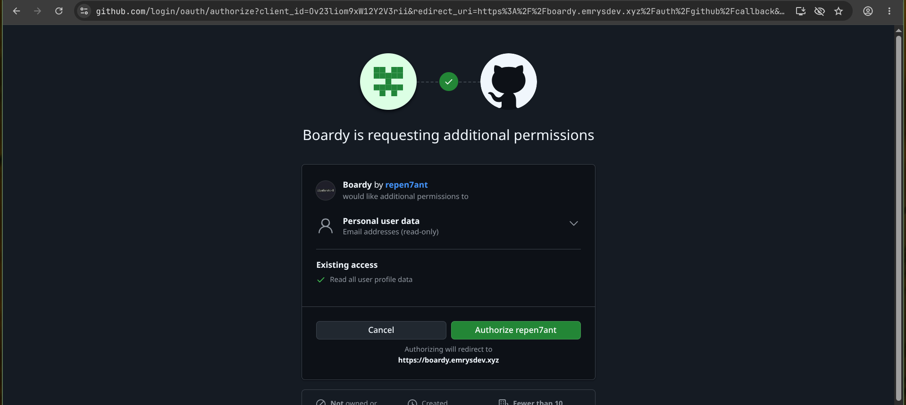
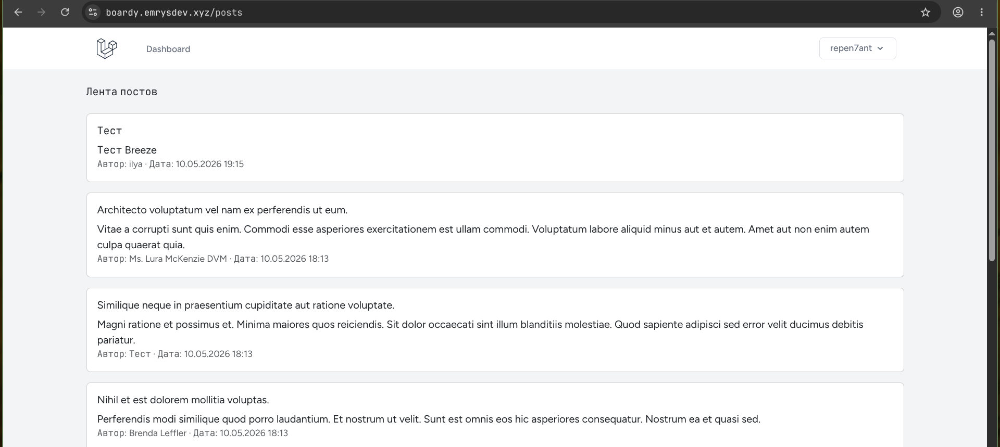
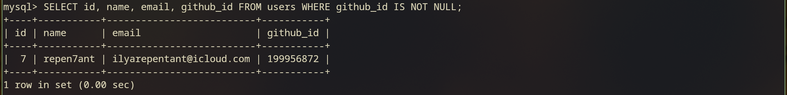

- Сравните количество строк кода Lab11 (ручной OAuth на чистом PHP) и Lab12 (Socialite). Что сократилось и за счёт чего?

Socialite инкапсулировал всю сложную логику работы с cURL и обмена токенами, сократив объем кода до пары простых вызовов методов `redirect()` и `user()`.

# Часть E. Архитектурные вопросы

## 22. Что осталось от прошлых практик

- Зачем мы их не удалили? Что произойдёт, если попробовать открыть https://фамилия.ai-info.ru/login.php (старый PHP-логин)?

Старые файлы оставлены для сохранения работоспособности предыдущих заданий, однако при попытке напрямую открыть старый `login.php` Nginx вернет ошибку 404, так как корень сайта теперь указывает на изолированную директорию `public/`.

## 23. FastAPI и React

- Почему сейчас не используем — что мешает интегрировать? Где они нам пригодятся в Lab13?

Сейчас они не интегрированы, так как Laravel выступает классическим монолитом с серверным рендерингом Blade-шаблонов, но они понадобятся в следующей лабораторной для построения SPA-архитектуры.

## 24. Реалтайм

- Какое архитектурное решение нам нужно, чтобы один пользователь видел новый комментарий другого без перезагрузки? Какие два сервера-кандидата для этого решения и почему именно они?

Для организации реалтайма необходимо использовать WebSockets, а лучшими решениями для этого являются Laravel Reverb или Soketi, так как они созданы специально для экосистемы Laravel и позволяют развернуть свой собственный сокет-сервер бесплатно.
