# Часть A. FastAPI: WebSocket

## Задание 1. ConnectionManager

Создан файл `routers/ws.py` с классом `ConnectionManager` и эндпоинтом `/ws`. Менеджер хранит список активных соединений и поддерживает методы `connect`, `disconnect` и `broadcast`. Дополнительно установлен пакет `uvicorn[standard]`, необходимый для поддержки WebSocket.

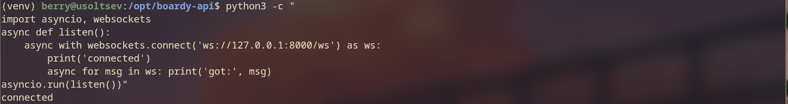

**Почему `self.active` — список в памяти процесса, а не в базе данных?**

WebSocket — это долгоживущее соединение, объект которого существует только внутри запущенного процесса. Сохранить его в базу данных технически невозможно: БД хранит данные, а не активные сетевые сокеты. Список в памяти обеспечивает мгновенный доступ без сетевых задержек. **Если Uvicorn перезапустится** — все соединения обрываются, список очищается, и клиентам потребуется переподключиться. Именно поэтому в задании 9 реализовано автопереподключение на стороне клиента.

---

## Задание 2. /internal/broadcast

Добавлен эндпоинт `POST /internal/broadcast` в `main.py`. При вызове он принимает JSON и рассылает его всем подключённым WebSocket-клиентам через `ConnectionManager.broadcast()`.

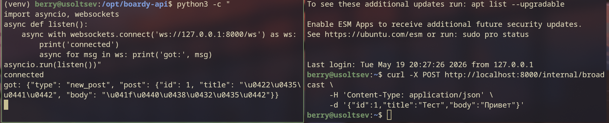

**Почему `/internal/broadcast` не требует JWT-авторизации?**

Этот эндпоинт вызывается не пользователем, а другим внутренним сервисом (Laravel) — добавление JWT усложнило бы межсервисное взаимодействие без практической пользы на уровне кода. **Риск:** любой, кто знает URL, может вызвать этот эндпоинт и разослать произвольные данные всем клиентам. Этот риск закрывает Nginx: правило `allow 127.0.0.1; deny all;` гарантирует, что `/internal/broadcast` недоступен снаружи — только с loopback-адреса того же сервера.

---

## Задание 3. Два клиента

Запущены два WebSocket-клиента. Через `curl POST /internal/broadcast` отправлено событие — оба клиента получили одинаковый JSON одновременно.

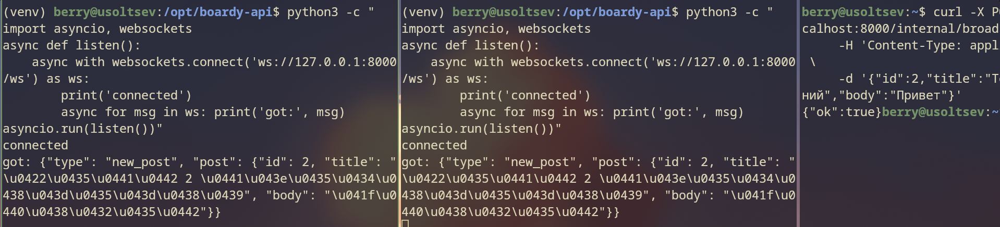

**Что произойдёт, если один из клиентов отключился, а broadcast уже начался?**

Если клиент разорвал соединение, попытка отправить ему сообщение выбросит исключение. В `ConnectionManager` это обрабатывается в блоке `try/except` внутри метода `broadcast`: при ошибке конкретное соединение удаляется из `self.active`, а рассылка продолжается для остальных клиентов — таким образом один отключившийся клиент не ломает всю рассылку.

---

# Часть B. Laravel: HTTP-callback

## Задание 4. PostController

В метод `store()` контроллера `PostController` добавлен вызов `Http::timeout(2)->post()` к эндпоинту FastAPI после успешного создания поста. В логах Laravel отсутствует строка `WS broadcast failed`, что подтверждает корректную работу.

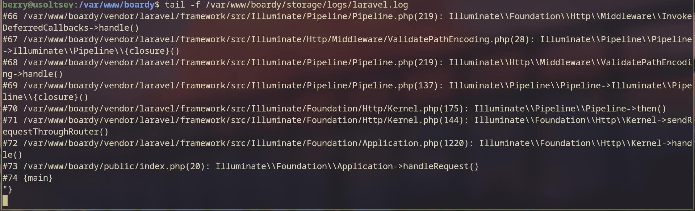

**Зачем `timeout(2)`?**

Без явного таймаута HTTP-запрос будет ждать ответа неопределённо долго. Если FastAPI недоступен, запрос Laravel зависнет — и вместе с ним зависнет весь цикл обработки запроса пользователя. При `timeout(2)` через 2 секунды Laravel зафиксирует ошибку в лог и вернёт ответ пользователю, не блокируя поток.

---

## Задание 5. Проверка callback

Создан пост через форму Laravel. В выводе Uvicorn зафиксирован входящий `POST /internal/broadcast`, что подтверждает получение события FastAPI.

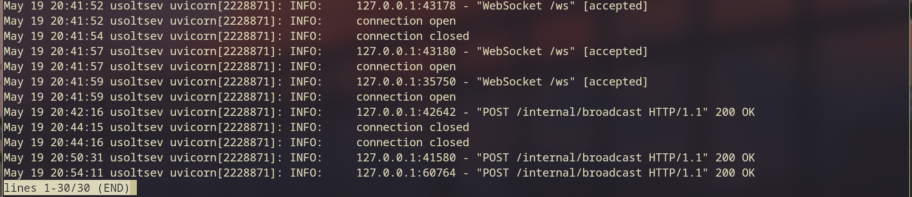

**Проблемы архитектуры HTTP-callback и почему это «костыль»:**

1. **Синхронная блокировка.** Laravel ждёт ответа FastAPI в рамках того же HTTP-запроса пользователя. Любая задержка на стороне FastAPI замедляет ответ пользователю — нарушается принцип независимости сервисов.

2. **Потеря событий при недоступности получателя.** Если FastAPI упал в момент создания поста, callback просто упадёт с ошибкой, событие будет потеряно безвозвратно. Нет механизма повтора или гарантии доставки.

3. **Жёсткая связанность сервисов.** Laravel должен знать точный URL FastAPI. При изменении адреса, масштабировании на несколько инстансов или деплое в другую среду — нужно менять конфигурацию Laravel. В правильной архитектуре это решается через брокер сообщений (RabbitMQ, Kafka, Redis Streams), который полностью разделяет отправителя и получателя.

---

# Часть C. JS-клиент

## Задание 6. WebSocket в Blade

В шаблон `index.blade.php` добавлен `id="posts-feed"` на контейнер постов и JavaScript-код для подключения к WebSocket-серверу через `wss://boardy-api.emrysdev.xyz/ws`. В DevTools → Network → WS видно соединение со статусом 101 Switching Protocols.

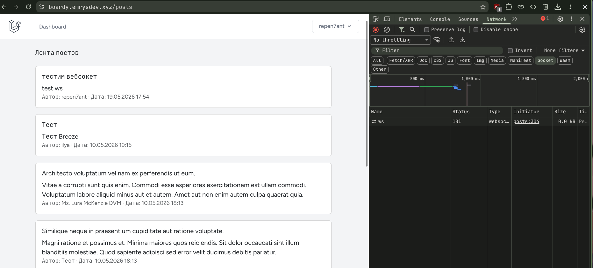

**Почему на локалке нужно `ws://`, а на проде `wss://`?**

`wss://` — это WebSocket поверх TLS (аналог HTTPS), шифрующий трафик. На продакшене современные браузеры блокируют «смешанное содержимое»: если страница открыта по `https://`, попытка открыть `ws://`-соединение будет заблокирована браузером с ошибкой `Mixed Content`. В данном проекте продакшн-сайт работает по HTTPS через Cloudflare Tunnel, который автоматически обеспечивает TLS-терминацию — поэтому клиент использует `wss://`, а Cloudflare прозрачно конвертирует его в `ws://` до Nginx. **Если использовать `wss://` без TLS** — браузер не установит соединение, так как не сможет выполнить TLS-рукопожатие с сервером.

---

## Задание 7. Два браузера

Открыты два браузера с приложением. Пост, созданный в первом браузере, появился в ленте второго без перезагрузки страницы. В DevTools → Network → WS → Messages виден входящий JSON-фрейм с данными поста.

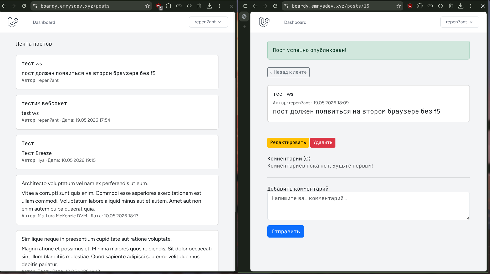
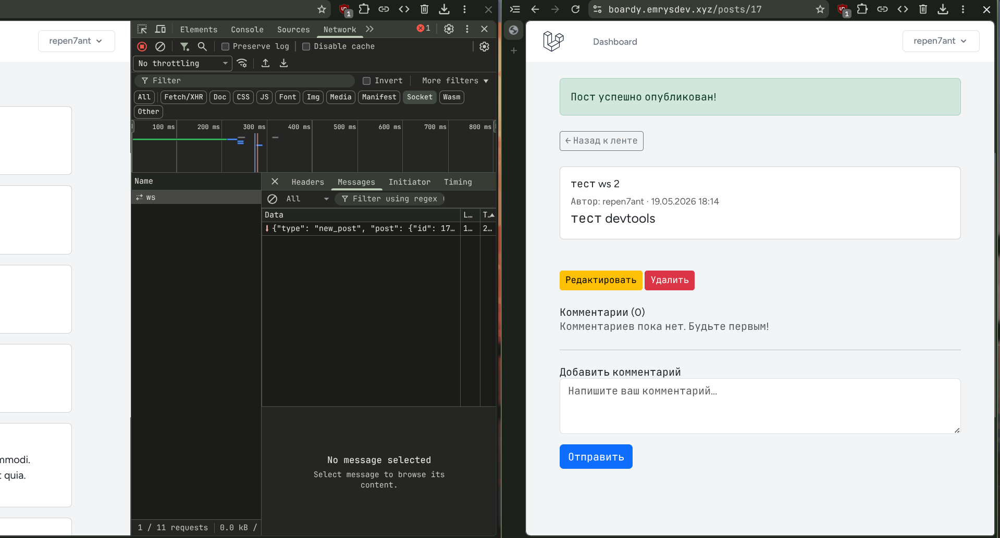

---

## Задание 8. XSS

Создан пост с телом `<script>alert('xss')</script>`. Alert не сработал — тег отобразился как обычный текст в ленте.

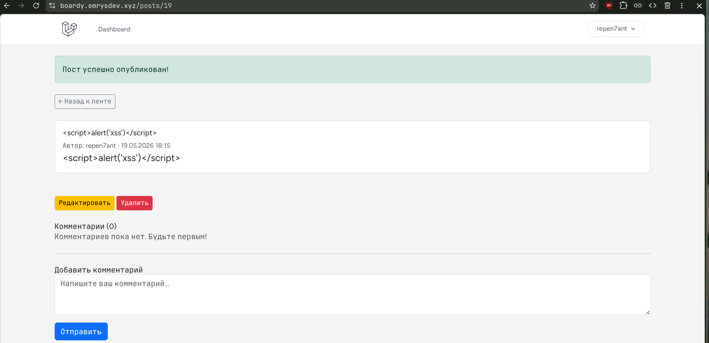

**Что делает `escapeHtml()`?**

Функция создаёт временный DOM-элемент, присваивает строку через `textContent` (который не интерпретирует HTML), и читает результат через `innerHTML` — браузер автоматически экранирует все спецсимволы: `<` → `&lt;`, `>` → `&gt;` и т.д. **Если вставить данные напрямую в `innerHTML`** — браузер выполнит любой тег, переданный в данных. Злоумышленник сможет выполнить произвольный JavaScript в контексте страницы: похитить куки, токены, перехватить ввод пользователя или перенаправить его на фишинговый сайт.

---

## Задание 9. Переподключение

Uvicorn остановлен командой `sudo systemctl stop boardy-api`, через 5 секунд запущен снова. В DevTools → Network → WS видны два соединения: первое со статусом Finished (соединение оборвалось), второе — активное с кодом 101 (JS автоматически переподключился через 3 секунды согласно `setTimeout(connect, 3000)`).

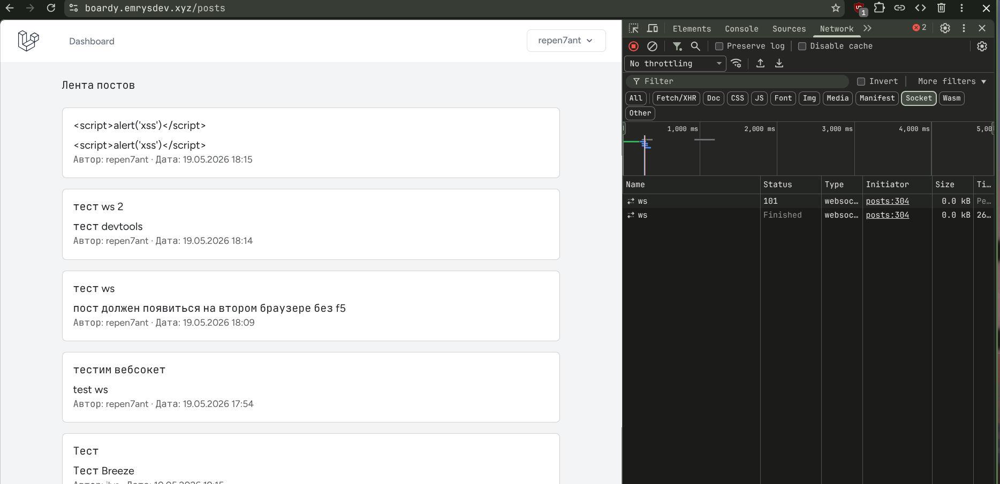

---

# Часть D. Nginx

## Задание 10. WS-проксирование

В конфигурацию Nginx для домена `boardy-api.emrysdev.xyz` добавлен блок `location /ws` с необходимыми директивами. Трафик проходит через Cloudflare Tunnel, который обеспечивает TLS-терминацию и конвертирует `wss://` → `ws://` до Nginx. Соединение через `wss://boardy-api.emrysdev.xyz/ws` успешно установлено со статусом 101.

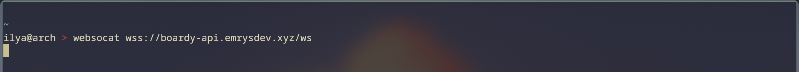

**Что сломается, если убрать директивы:**

- **`proxy_http_version 1.1`** — Nginx по умолчанию использует HTTP/1.0 для проксирования, а WebSocket требует HTTP/1.1 (поддерживающий persistent connections). Без этой директивы Nginx не сможет установить WebSocket-соединение.

- **`proxy_set_header Upgrade`** — это ключевой заголовок WebSocket-рукопожатия. Без него Nginx не передаст серверу запрос на смену протокола, FastAPI не получит сигнал для upgrade и вернёт обычный HTTP-ответ вместо WebSocket-соединения.

- **`proxy_read_timeout`** — без явного таймаута Nginx закроет «неактивное» WebSocket-соединение через стандартные 60 секунд молчания. Пользователи будут неожиданно терять соединение даже при нормальной работе.

---

## Задание 11. Закрыть /internal

В конфигурацию Nginx добавлен блок `location /internal` с правилами `allow 127.0.0.1; deny all;`. Для проверки использован виртуальный интерфейс `127.0.0.2` на loopback-устройстве — Nginx видит IP не из списка `allow` и возвращает `403 Forbidden`.

Проверка выполнена командой:

```bash
sudo ip addr add 127.0.0.2/8 dev lo
curl --interface 127.0.0.2 -X POST http://127.0.0.1:80/internal/broadcast \
     -H "Host: boardy-api.emrysdev.xyz" \
     -H "Content-Type: application/json" -d '{}'
```

Ответ: `{"detail":"Forbidden"}` со статусом `403`.

_Примечание: прямая проверка через внешний URL невозможна, так как Cloudflare Tunnel перехватывает запросы на своём уровне до Nginx. Блокировка на уровне Nginx подтверждена через симуляцию внешнего IP с помощью виртуального loopback-адреса._

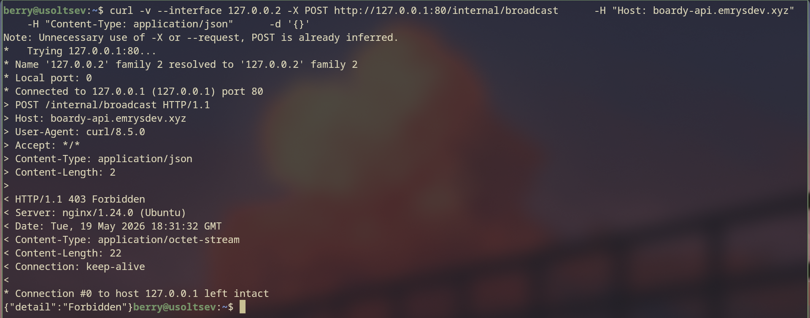

**Почему `/internal/broadcast` опасен без ограничения доступа?**

Эндпоинт принимает произвольный JSON и рассылает его всем подключённым пользователям как доверенное событие приложения. Без ограничения любой внешний злоумышленник может:

- отправить поддельные данные всем пользователям (фейковые посты, системные уведомления);
- организовать флуд и перегрузить сервер broadcast-рассылками;
- использовать его для XSS-атак, если данные вставляются в DOM без экранирования.

**Кто мог бы его вызвать:** любой, кто знает URL сервера и имеет доступ в интернет — боты, сканеры, злоумышленники. Ограничение `allow 127.0.0.1` гарантирует, что вызов возможен только с того же хоста, то есть исключительно от Laravel, работающего на той же машине.
