# Часть А. Passport как OAuth 2.1 сервер

## Задание 1. Установка и SPA-клиент

Установлен Laravel Passport (`composer require laravel/passport`, `php artisan passport:install`), сгенерированы ключи подписи (`oauth-private.key` / `oauth-public.key`) в `storage/`. Командой `php artisan passport:client --public` создан **публичный клиент с поддержкой PKCE** для React-приложения с указанием `redirect_uri` на страницу callback (prod + localhost). В Passport 13 команда `passport:install` не печатает Client ID в баннере — он берётся из таблицы `oauth_clients`.

Так как SPA — доверенное first-party-приложение, для него отключён экран согласия: добавлена модель `App\Models\PassportClient` (`Passport::useClientModel`), у которой `skipsAuthorization()` возвращает `true` для публичных клиентов (без secret). Тогда `/oauth/authorize` сразу редиректит обратно с `code`, без шага подтверждения.

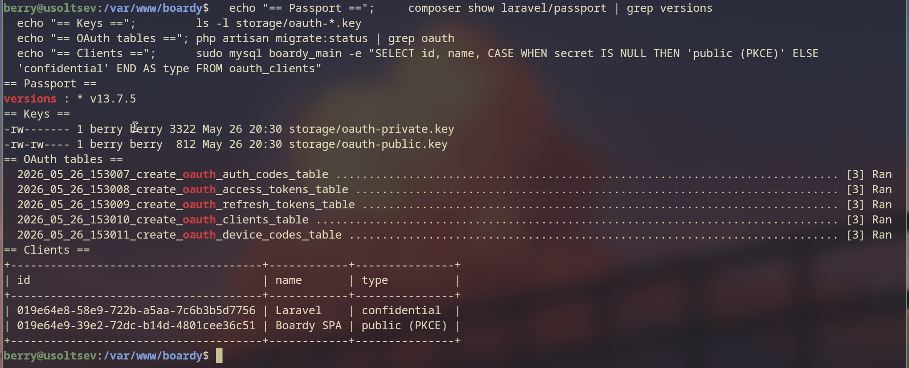
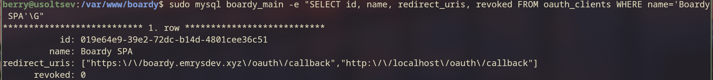

**Почему публичный клиент без secret? Чем PKCE заменяет client_secret и от какой атаки защищает?**

React — это SPA, код которого целиком выполняется в браузере и доступен пользователю: любой `client_secret`, зашитый в JS-бандл, можно извлечь через DevTools. Секрет, который невозможно сохранить в тайне, не даёт никакой защиты — поэтому такой клиент объявляется **публичным** (без secret).

Вместо постоянного секрета PKCE (Proof Key for Code Exchange) использует одноразовое динамическое доказательство: клиент генерирует случайный `code_verifier`, отправляет на `/authorize` только его SHA-256-хеш (`code_challenge`), а при обмене на токен предъявляет оригинальный `code_verifier`. Сервер проверяет, что `sha256(verifier) == challenge`. PKCE защищает от **перехвата authorization code**: даже если злоумышленник перехватит `code` из редиректа, он не сможет обменять его на токен, потому что не знает `code_verifier`, который никогда не покидал исходный клиент.

---

## Задание 2. TTL и refresh

В `AuthServiceProvider` настроено время жизни токенов: `Passport::tokensExpireIn(now()->addMinutes(15))` для access-токена и `Passport::refreshTokensExpireIn(now()->addDays(30))` для refresh-токена.

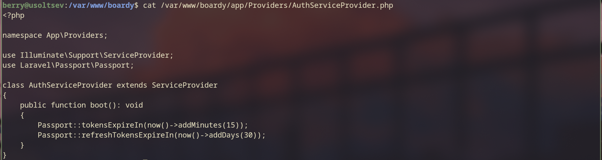

**Почему access короткий, а refresh длинный? Что произойдёт если access будет 24 часа?**

Access-токен отправляется в каждом запросе к API и хранится в памяти JS — у него высокая «экспозиция». При RS256 он проверяется без обращения к базе (stateless) и потому **не отзывается** на стороне сервера: единственная защита от утёкшего токена — его быстрое истечение. Refresh-токен, наоборот, используется редко (только для получения нового access), хранится в HttpOnly-cookie, недоступной JS, и **хранится в БД Passport, то есть отзывается**. Поэтому ему можно дать долгий срок ради удобства (30 дней без повторного логина).

Если сделать access на 24 часа: утёкший токен (через XSS, логи, прокси) даёт злоумышленнику полный доступ к API на целые сутки, причём stateless RS256-токен нельзя отозвать досрочно — окно атаки становится огромным.

---

## Задание 3. Проверка выдачи через curl

С использованием Client ID публичного клиента вручную сгенерированы `code_verifier` и `code_challenge` (через `openssl rand` + `openssl dgst -sha256 -binary | base64url`). После логина тестовым аккаунтом (нужна авторизованная сессия) получен `code` через `/oauth/authorize`, затем обменян на токены через `POST /oauth/token` — в ответе пришли `access_token` (RS256, `expires_in: 900` = 15 минут) и `refresh_token`.

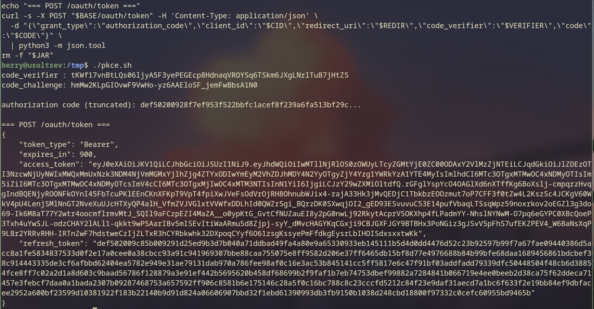

**Какие шаги OAuth flow прошёл этот curl-запрос?**

Это **Authorization Code Flow с PKCE**:

1. Сгенерирован случайный `code_verifier`.
2. Вычислен `code_challenge = base64url(sha256(code_verifier))`.
3. Запрос `GET /oauth/authorize` с параметрами `response_type=code`, `client_id`, `redirect_uri`, `code_challenge`, `code_challenge_method=S256`, `state` → пользователь аутентифицируется и подтверждает доступ → сервер редиректит на `redirect_uri?code=...&state=...`.
4. Запрос `POST /oauth/token` с `grant_type=authorization_code`, `code`, `code_verifier`, `client_id`, `redirect_uri` → сервер проверяет, что `sha256(code_verifier) == code_challenge`, и возвращает `access_token` + `refresh_token`.

---

# Часть Б. Две базы данных

## Задание 4. Создание boardy_api

Создана отдельная база данных `boardy_api` для FastAPI. Таблица `comments` перенесена в неё, причём вместо внешнего ключа `author_id` + JOIN добавлено денормализованное поле `author_name`.

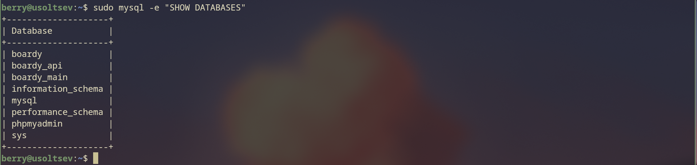
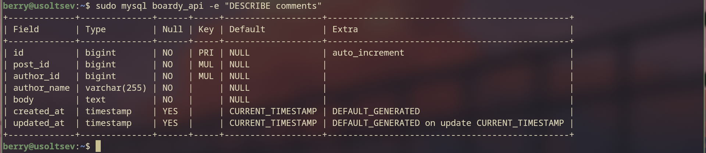

**Почему в comments нет FK на posts и users? Что делать с целостностью данных?**

Таблица `comments` теперь живёт в другой базе (`boardy_api`), а `posts` и `users` остались в `boardy_main`. MySQL **не поддерживает внешние ключи между разными базами**, и в микросервисной архитектуре сервисы намеренно не делят схему — поэтому FK здесь невозможен по определению.

Целостность обеспечивается на уровне приложения и через денормализацию: `author_name` копируется в `comments` в момент записи, поэтому JOIN к `users` больше не нужен. Согласованность между сервисами становится **eventual** (отложенной) и поддерживается событиями: при переименовании пользователя событие `user.renamed` через Redis обновляет `author_name`. «Осиротевшие» комментарии (удалён пост) обрабатываются логикой приложения и событиями, а не каскадом БД.

---

## Задание 5. FastAPI подключён к новой БД

В `database.py` параметр `db` в `DB_CONFIG` изменён на `boardy_api`. Запрос `GET /api/posts/1/comments` возвращает данные из новой базы.

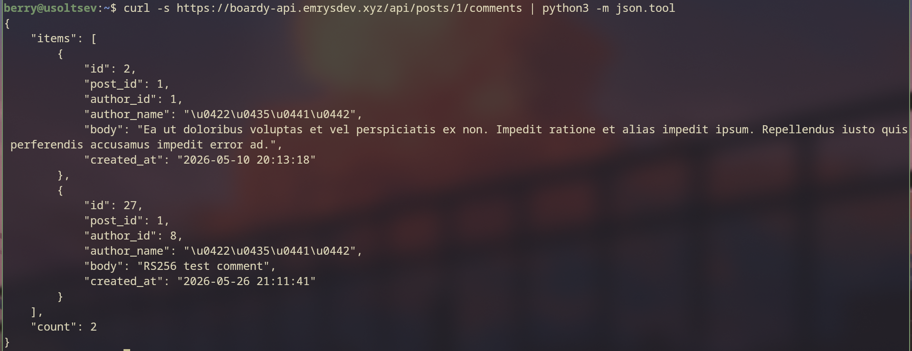

---

# Часть В. FastAPI: RS256 + полный CRUD

## Задание 6. RS256 проверка

Публичный ключ Passport (`oauth-public.key`) скопирован в каталог FastAPI. Файл `auth.py` переписан на проверку подписи алгоритмом **RS256** этим публичным ключом, симметричный `SECRET_KEY` (HS256) удалён.

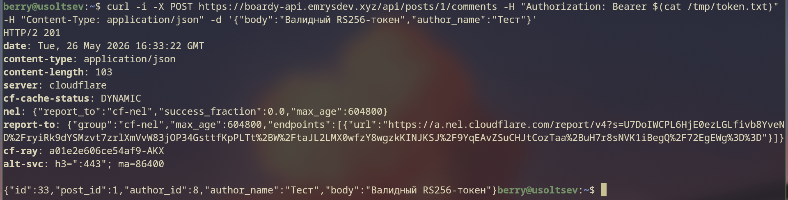
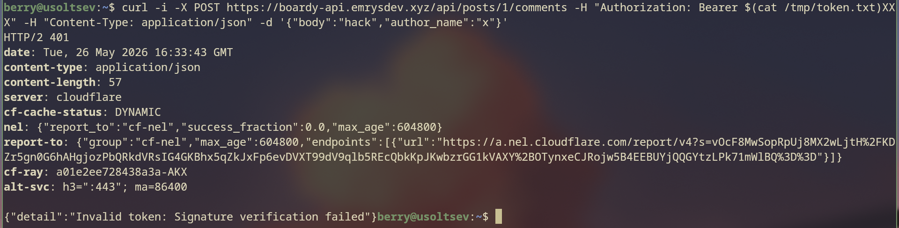

**Почему RS256 безопаснее HS256 для распределённых систем?**

HS256 — симметричный алгоритм: один и тот же секрет используется и для подписи, и для проверки. Чтобы FastAPI мог проверять токены, ему нужно знать тот же секрет, которым подписывает Laravel — а значит, FastAPI (и любой другой сервис) сможет и **подделывать** токены. Утечка секрета в одном сервисе компрометирует всю систему.

RS256 — асимметричный: Passport подписывает токены **приватным** ключом, а FastAPI проверяет их **публичным**. Публичным ключом подделать токен нельзя, поэтому его можно безопасно раздать любому числу сервисов. Компрометация FastAPI не позволит злоумышленнику выпускать валидные токены. Именно поэтому RS256 подходит для распределённых/микросервисных систем.

---

## Задание 7. Полный CRUD с author_name

В `routers/comments.py` реализованы все четыре эндпоинта: `GET`, `POST`, `PUT`, `DELETE`. Поле `author_name` приходит в теле запроса (payload) и сохраняется в `comments`.

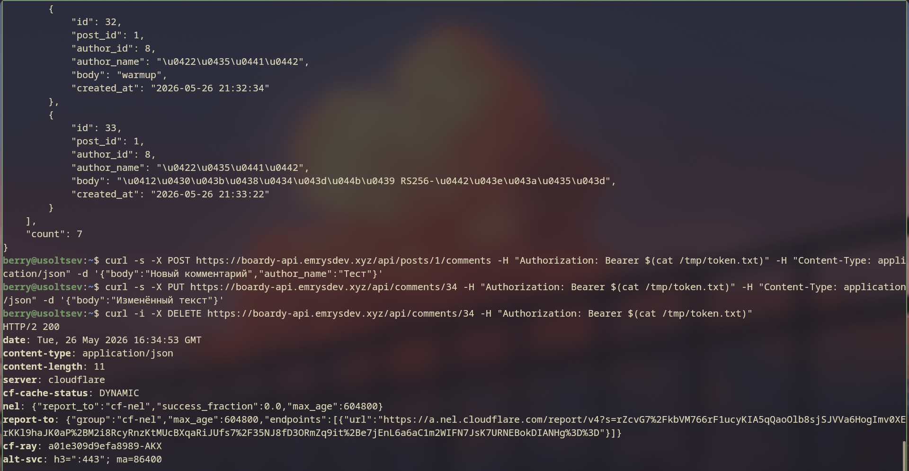

**Почему author_name передаётся в payload запроса, а не извлекается из токена? Что было бы если зашить в JWT custom claim?**

Из токена извлекается **доверенная личность** — `author_id` (claim `sub`), который и используется для проверки владельца. Имя же в стандартном access-токене Passport не передаётся, и `author_name` — это просто денормализованное поле для отображения.

Если зашить имя как custom claim в JWT, оно «замёрзнет» в момент выпуска токена: при переименовании пользователя все его уже выданные токены (живущие до 15 минут, а через refresh-цепочку — до 30 дней) продолжат носить **старое** имя, пока не истекут. Токен иммутабелен — обновить его нельзя. Поэтому имя передаётся в payload и поддерживается в актуальном состоянии через событие `user.renamed` (см. задание 19), а не вшивается в токен.

---

## Задание 8. Owner check

Попытка изменить (`PUT`) или удалить (`DELETE`) чужой комментарий возвращает `403 Forbidden`.

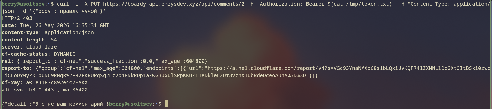

**Где в коде проверяется владелец? Что произойдёт если убрать эту проверку?**

В методах `update_comment` и `delete_comment` перед изменением выполняется выборка `author_id` комментария из БД и сравнение с `user_id` из проверенного JWT (`user["sub"]`). При несовпадении выбрасывается `HTTPException(403)`.

Если убрать проверку, любой авторизованный пользователь сможет редактировать и удалять чужие комментарии — это нарушение контроля доступа (OWASP A01: Broken Access Control): вандализм, цензура и удаление чужого контента.

---

## Задание 9. CORS

В `CORSMiddleware` указан конкретный домен (`allow_origins=["https://boardy.emrysdev.xyz"]`), а не `*`.

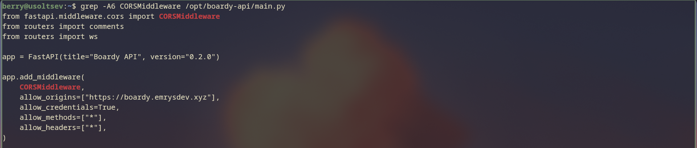

**Почему allow_origins=['*'] + credentials=true браузер блокирует? Что произошло бы с куками если бы пропустил?**

Спецификация CORS **запрещает** сочетание `Access-Control-Allow-Origin: *` с `Access-Control-Allow-Credentials: true` — браузер отвергает такой ответ. Если в запросе участвуют учётные данные (cookies), сервер обязан вернуть конкретный origin, а не wildcard.

Причина: если бы wildcard с credentials был разрешён, **любой** вредоносный сайт мог бы делать межсайтовые запросы с куками жертвы (включая `refresh_token`) и читать ответы — то есть красть данные и действовать от имени пользователя. Ограничение конкретным origin гарантирует, что запросы с credentials принимаются только от нашего React-приложения.

---

# Часть Г. React PKCE flow

## Задание 10. PKCE утилиты

В `pkce.js` реализованы функции `generateVerifier` (случайная строка), `generateChallenge` (`base64url(sha256(verifier))` через Web Crypto API) и `generateState` (случайный токен против CSRF). В консоли DevTools выведены сгенерированные значения.

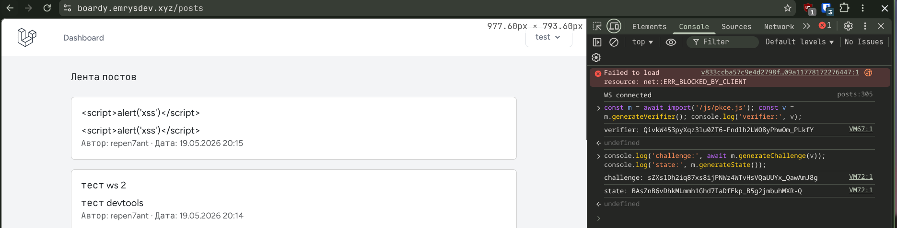

**Почему code_challenge передаётся в /authorize, а code_verifier — в /token? Что если перепутать?**

Безопасность PKCE держится на том, что `verifier` остаётся секретным до момента обмена на токен. Запрос `/authorize` проходит через браузер и редиректы — он виден в URL, истории, логах прокси. Поэтому туда отправляется только `challenge` = одностороннему хешу `verifier`, бесполезному для перехватчика. Сам секрет (`verifier`) уходит позже на `/token` — это прямой back-channel POST. Сервер проверяет `sha256(verifier) == challenge`.

Если перепутать и отправить `verifier` уже на `/authorize`, секрет утечёт в URL редиректа: злоумышленник, перехвативший `code`, заодно получит и `verifier` и сможет завершить обмен — защита PKCE сводится к нулю.

---

## Задание 11. Login flow

Кнопка «Войти» в `auth.js` инициирует PKCE-flow: генерирует `verifier`/`challenge`/`state`, сохраняет их локально и редиректит на `/oauth/authorize` с `code_challenge` и `state`. После авторизации происходит обратный редирект на callback с `code` и `state`.

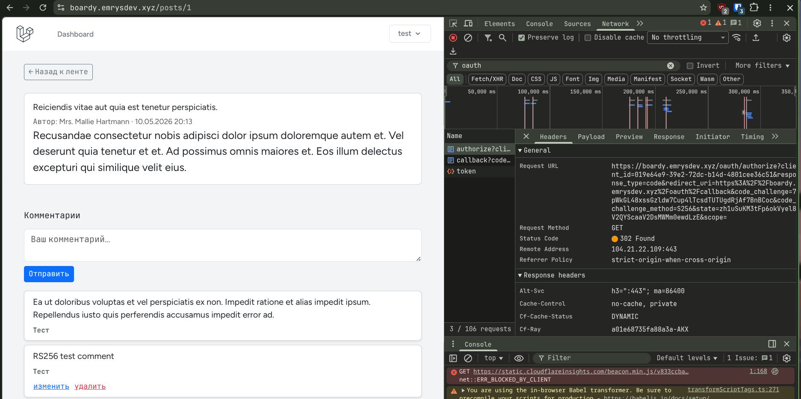
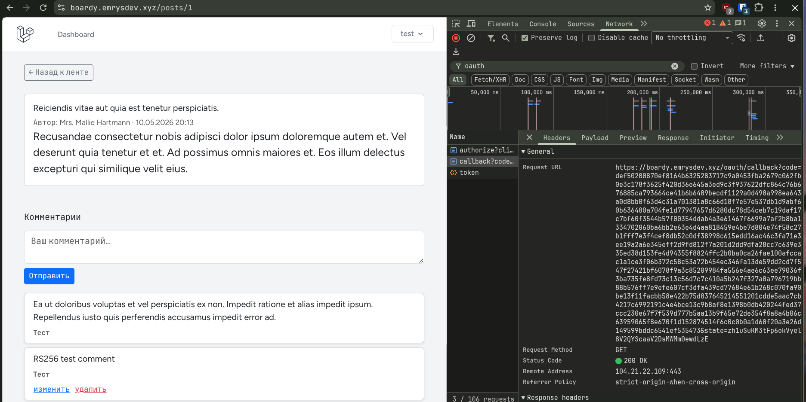

---

## Задание 12. Обмен code на токены

Реализован `handleCallback`: перед обменом проверяется, что вернувшийся `state` совпадает с сохранённым; затем выполняется `POST /oauth/token` с `code` и `code_verifier`, в ответе приходит `access_token`.

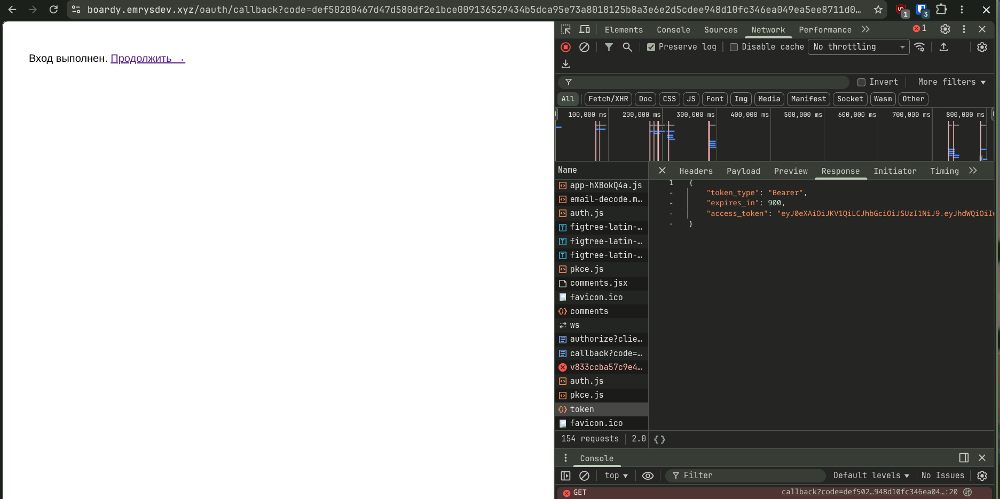

**Что произойдёт если убрать проверку state? Какая атака возможна?**

`state` — случайное значение, сгенерированное перед `/authorize` и сохранённое локально; на callback мы проверяем его совпадение. Без этой проверки возможна **CSRF-атака на авторизацию** (login CSRF / code injection): злоумышленник запускает свой flow, получает свой `code` и заставляет браузер жертвы вызвать callback с этим `code` — в результате жертва логинится в **аккаунт злоумышленника** (или к её сессии привязывается чужой код), что ведёт к фиксации сессии и утечке данных. `state` привязывает callback именно к тому запросу, который инициировал сам клиент.

---

## Задание 13. Refresh token в HttpOnly cookie

Middleware `RefreshTokenCookie` перехватывает ответ `/oauth/token`, вынимает `refresh_token` из тела и перекладывает его в cookie с флагами `HttpOnly` и `Secure` (тело ответа очищается от refresh-токена).

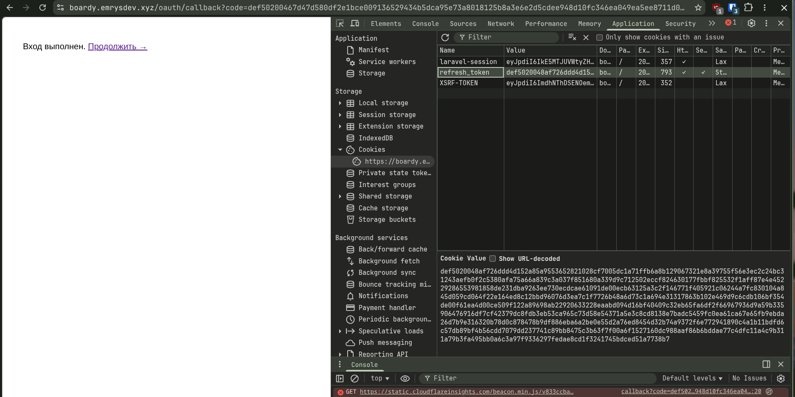

**Что случится если refresh положить в localStorage и сайт получит XSS?**

`localStorage` полностью доступен любому JS на странице. При XSS скрипт злоумышленника прочитает `refresh_token` и отправит его себе; поскольку refresh живёт 30 дней и выпускает новые access-токены, атакующий получает **долговременный, возобновляемый доступ** — фактически постоянный угон аккаунта, переживающий закрытие браузера. Cookie с `HttpOnly` недоступна JS, поэтому XSS её не прочитает; `Secure` гарантирует передачу только по HTTPS.

---

## Задание 14. Silent refresh

При получении `401` от FastAPI клиент (`auth.js`) автоматически выполняет `POST /oauth/token` с `grant_type=refresh_token` (refresh берётся из HttpOnly-cookie), получает новый access-токен и повторяет исходный запрос. Для теста TTL access-токена сокращён до 1 минуты.

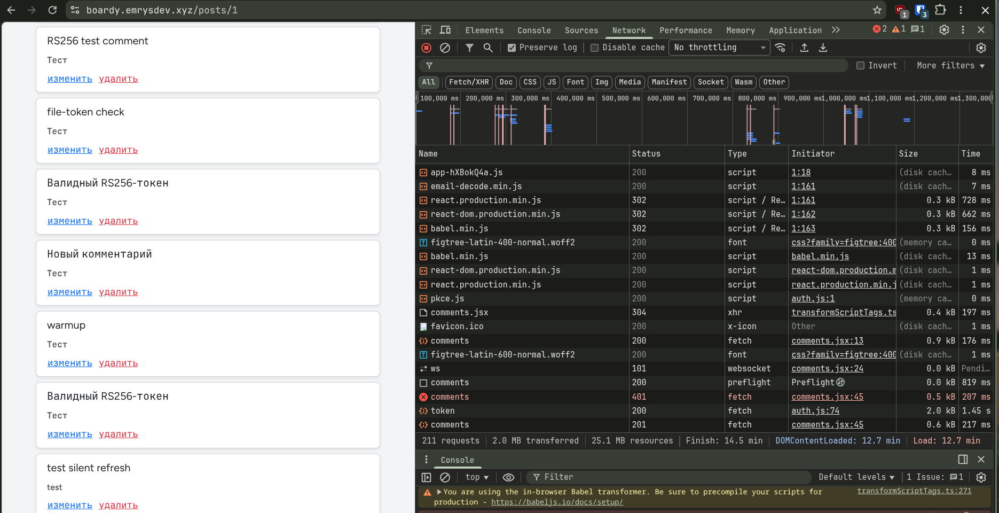

---

# Часть Д. Redis Pub/Sub

## Задание 15. Redis установлен

Redis установлен и запущен; `redis-cli ping` отвечает `PONG`. Порт 6379 закрыт от внешнего мира через `ufw` (`6379 DENY`), доступ только с loopback.

---

## Задание 16. Laravel publish new_post

HTTP-callback из практики 13 (`Http::timeout(2)->post('.../internal/broadcast')`) удалён из `PostController::store()` и заменён на `Redis::publish('new_post', json_encode([...]))` (использован клиент `predis`). При создании поста в `redis-cli monitor` видна команда `PUBLISH new_post ...`.

Важная деталь: в `.env` задан пустой `REDIS_PREFIX=`. По умолчанию Laravel префиксует имена каналов (`laravel-database-new_post`), и тогда подписчик FastAPI, слушающий голый `new_post`, событие бы не получил. Пустой префикс безопасен, так как Redis в проекте используется только для pub/sub (кэш и сессии — в БД).

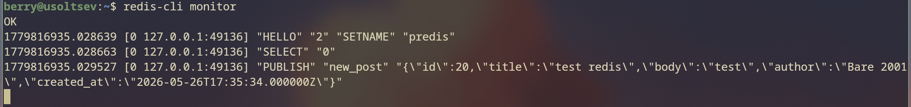

**Чем Redis::publish архитектурно лучше Http::post() к FastAPI?**

`Http::post()` — синхронный и точечный вызов: Laravel блокируется в ожидании ответа FastAPI внутри пользовательского запроса, должен знать точный URL FastAPI и теряет событие, если FastAPI недоступен.

`Redis::publish` — это fire-and-forget pub/sub: Laravel публикует событие в канал и сразу возвращается (без блокировки), не зная и не интересуясь, кто подписан (слабая связанность). Подписчиков может быть ноль, один или много, а добавление нового потребителя не требует изменений в Laravel. Producer и consumer разделены во времени и пространстве. (Компромисс: Redis pub/sub — at-most-once без персистентности, но он убирает жёсткую HTTP-связь.)

---

## Задание 17. FastAPI subscriber на new_post

В `main.py` через `lifespan` при старте приложения запускается фоновая задача-подписчик, слушающая каналы `new_post` и `user.renamed`. Полученное событие `new_post` транслируется всем WebSocket-клиентам через `manager.broadcast`. В логах Uvicorn при старте видно сообщение `Redis subscriber started`.

Использован `from redis import asyncio as aioredis` (модуль `redis.asyncio`), а не отдельный пакет `aioredis` — последний несовместим с Python 3.12 (конфликт базовых классов `TimeoutError`). API (`from_url`, `pubsub`, `subscribe`, `listen`) идентичен.

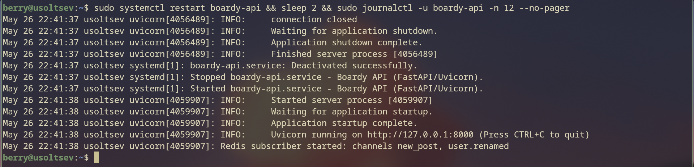
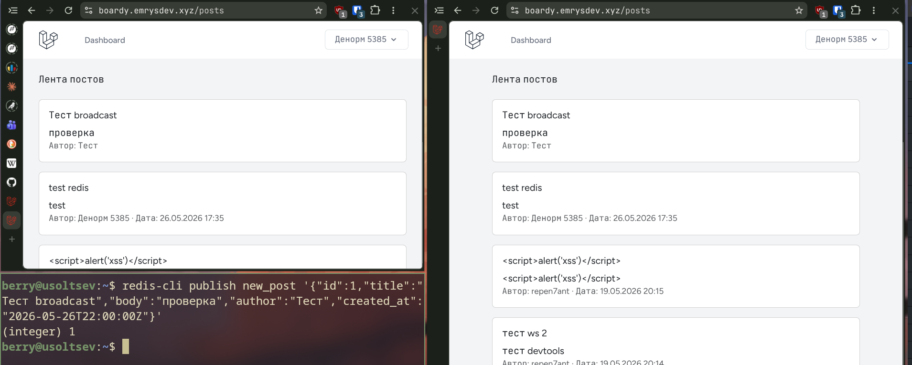

---

## Задание 18. User observer и user.renamed

Создан `UserObserver`, зарегистрированный на модель `User`. При изменении имени пользователя метод `updated()` проверяет `wasChanged('name')` и публикует событие `user.renamed` в Redis. В `redis-cli monitor` при смене имени (через tinker или профиль) видна команда `PUBLISH user.renamed ...`.

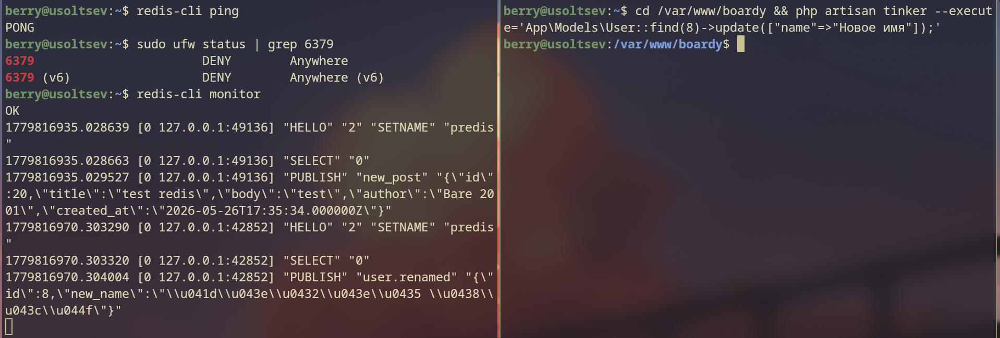

**Почему UserObserver вызывается автоматически? Где это магия Laravel?**

Eloquent при каждом сохранении модели генерирует события жизненного цикла (`creating`/`created`/`updating`/`updated` и т.д.). Observer, зарегистрированный для модели `User` (через `User::observe(UserObserver::class)` в `boot()` сервис-провайдера или атрибут `#[ObservedBy]`), подписывается на эти события. Когда мы меняем `name` и вызываем `save()`, Eloquent в методе `performUpdate` диспетчеризует событие `updated`, и диспетчер событий Laravel автоматически вызывает метод `updated()` обсервера — ручной вызов не нужен. «Магия» — именно во внутренней рассылке событий Eloquent при сохранении модели.

---

## Задание 19. Денормализация имени

FastAPI-subscriber подписан также на канал `user.renamed`. При получении события выполняется `UPDATE comments SET author_name=%s WHERE author_id=%s`. До смены имени `SELECT author_name` показывает старое значение, после — обновлённое.

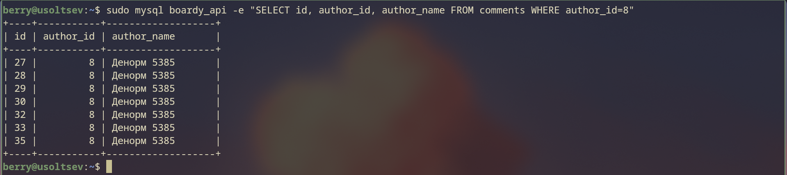
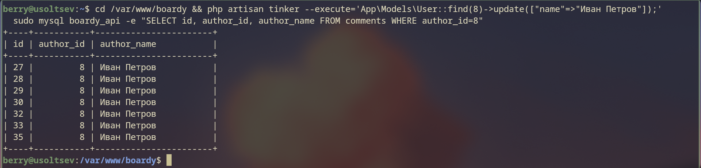

**Что такое eventual consistency? Когда между сменой имени и обновлением comments может быть задержка?**

Eventual consistency (отложенная согласованность) — данные в разных сервисах обновляются не атомарно и не мгновенно: какое-то время разные хранилища держат разные значения, но при отсутствии новых изменений они в итоге сходятся к одному. Здесь: строка `boardy_main.users` обновляется сразу, а `boardy_api.comments.author_name` — только после того, как событие пройдёт путь Redis → subscriber FastAPI → `UPDATE`.

Задержка возможна, если: Redis перегружен; subscriber FastAPI выключен или перезапускается (событие теряется, так как pub/sub не персистентен — имя останется старым до следующего переименования); высокая сетевая латентность; много событий в очереди. В этом окне комментарии показывают старое имя, а профиль — уже новое.

---

# Часть Е. Финальные проверки

## Задание 20. Два браузера: посты в реалтайме

Пост, созданный в одном браузере, появляется в ленте второго без перезагрузки (F5) — через цепочку `Redis::publish` → subscriber FastAPI → WebSocket broadcast.

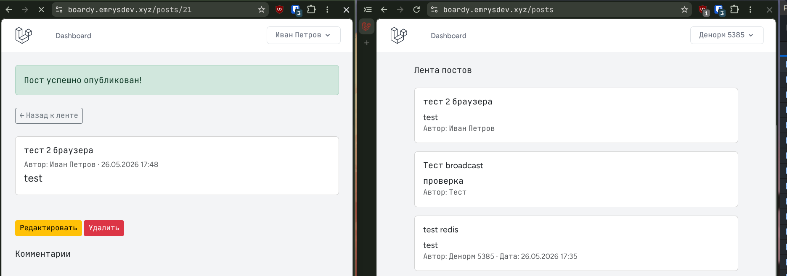

---

## Задание 21. Два браузера: комментарии в реалтайме

Все три операции с комментариями (создание, изменение, удаление) в одном браузере отражаются во втором без перезагрузки.

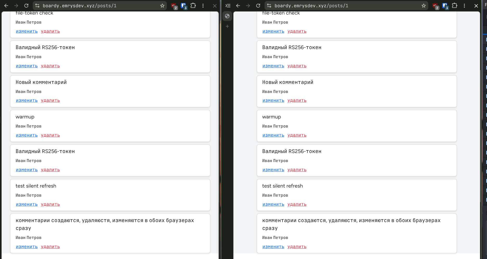

---

## Задание 22. Никаких прямых HTTP-вызовов

Между Laravel и FastAPI больше нет прямых HTTP-запросов: в коде отсутствует `Http::post()` к FastAPI (заменён на `Redis::publish`), а в конфигурации Nginx удалён блок `location /internal` и эндпоинт `/internal/broadcast`.

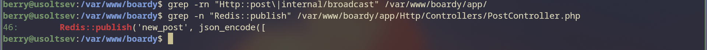
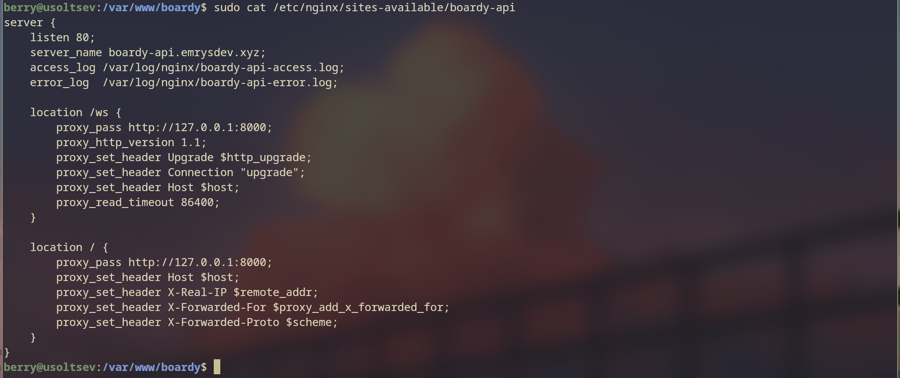
