# Часть А. Dockerfile и сборка образов

## Задание 1. Dockerfile для Laravel

Написан `boardy-laravel/Dockerfile` на базе `php:8.3-fpm`. Зависимости ставятся двумя слоями: сначала `COPY composer.json composer.lock` + `RUN composer install` — для кэширования слоя зависимостей; затем `COPY . .` + `composer dump-autoload`. Сборка Vite-ассетов (`npm ci && npm run build`) выполняется в том же образе и артефакты попадают в `public/build/`.

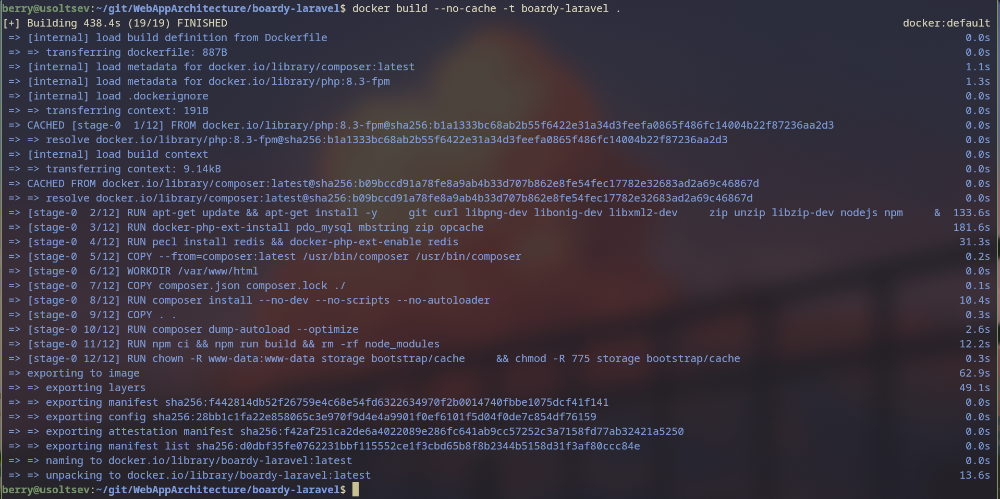

**Зачем копировать composer.json/lock отдельно, до COPY . .?**

Docker строит образ слой за слоем и кэширует каждый. Если скопировать весь проект сразу, любое изменение в любом PHP-файле инвалидирует кэш с `composer install` — и полная установка зависимостей (сотни пакетов) будет запускаться при каждой сборке. Разделяя слои, мы гарантируем: пока `composer.json`/`composer.lock` не изменились, слой с `vendor/` берётся из кэша. Это сокращает время сборки с нескольких минут до секунд в типичных рабочих итерациях.

---

## Задание 2. Кэш слоёв работает

При повторной сборке без изменений в зависимостях шаг `composer install` получает статус `CACHED`. Docker не скачивает пакеты повторно.


**Что произойдёт с кэшем если изменить один PHP-файл? А если изменить composer.json?**

При изменении PHP-файла: слои до `COPY . .` остаются в кэше (включая `composer install`), инвалидируется только слой `COPY . .` и последующие. Сборка быстрая.

При изменении `composer.json` или `composer.lock`: инвалидируется слой `COPY composer.json composer.lock ./`, и все последующие слои пересобираются заново — `composer install` запускается с нуля. Именно поэтому в lock-файл стоит фиксировать точные версии: `composer.lock` меняется только при явном обновлении зависимостей, а не при каждом `git commit`.

---

## Задание 3. .dockerignore для Laravel

Файл `boardy-laravel/.dockerignore` исключает `node_modules/`, `vendor/`, `.env`, `.env.*`, `storage/logs/*`, `storage/framework/cache/*` и другие runtime-артефакты из контекста сборки.

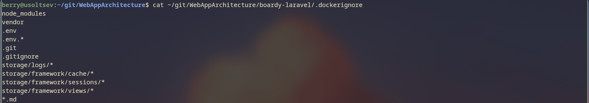

**Что произойдёт если не исключить node_modules и vendor из контекста?**

Docker CLI перед отправкой контекста на демон упаковывает все файлы директории в tar-архив. `node_modules` может весить сотни мегабайт (тысячи мелких файлов), `vendor/` — ещё столько же. Без `.dockerignore` при каждом `docker build` клиент будет передавать гигабайты данных демону даже если dockerfile не использует эти директории — это многократно замедляет начало сборки. Кроме того, `.env` с секретами может случайно попасть в образ через широкий `COPY . .`.

---

## Задание 4. FastAPI: requirements.txt с пиннингом версий

В `boardy-api/requirements.txt` зафиксированы точные версии всех зависимостей (например, `fastapi==0.135.3`, `pyjwt[crypto]==2.12.1`). `requirements.txt` копируется и устанавливается отдельным шагом до `COPY . .` — по той же логике кэширования слоёв, что и в Laravel.

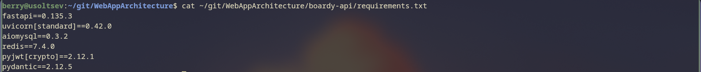

**Зачем пинить версии? Чем чревата строка `fastapi` без версии?**

`pip install fastapi` без версии установит последний релиз на момент сборки. Через неделю вы пересобираете образ — и получаете другую версию FastAPI с изменённым API или сломанной совместимостью с вашим кодом. Пиннинг `fastapi==0.135.3` делает сборки **воспроизводимыми**: образ, собранный сегодня и через год, будет работать идентично. Это ключевое требование для production: деплой должен быть детерминированным.

---

## Задание 5. Dockerfile для FastAPI

`boardy-api/Dockerfile` использует `python:3.11-slim` как базовый образ. Устанавливаются только `build-essential` и `libssl-dev` для сборки криптографических зависимостей PyJWT. Зависимости разделены от кода (кэш слоя).

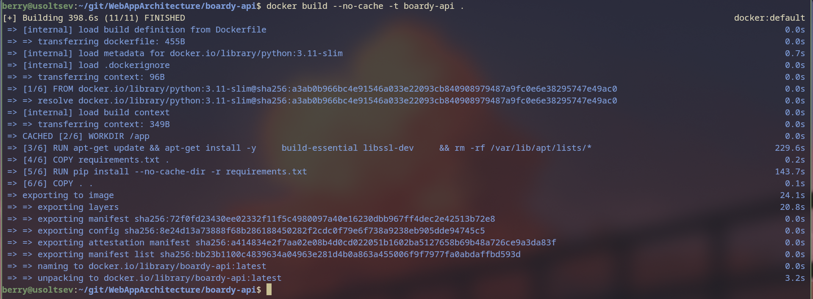

**Почему python:3.11-slim, а не python:3.11? Какой выигрыш?**

`python:3.11` основан на Debian full и включает компиляторы, dev-заголовки, документацию — всё, что нужно для разработки, но лишнее в контейнере. `slim` — минимальная версия: только рантайм Python. Разница в размере образа — 300–400 МБ vs ~50 МБ. Меньший образ: быстрее скачивается при деплое, меньше attack surface (меньше пакетов → меньше уязвимостей), меньше занимает место в registry. Нужные нам `build-essential` и `libssl-dev` устанавливаются явно на шаге `RUN apt-get install` и могут быть удалены после компиляции.

---

## Задание 6. CMD и точка входа FastAPI

В конце `boardy-api/Dockerfile` указан `CMD ["uvicorn", "main:app", "--host", "0.0.0.0", "--port", "8000"]`. Флаг `--host 0.0.0.0` обязателен для доступа из других контейнеров.


**Почему --host 0.0.0.0, а не 127.0.0.1? Что будет если оставить localhost?**

По умолчанию uvicorn слушает на `127.0.0.1` — только на loopback-интерфейсе контейнера. Внутри Docker-сети контейнеры общаются через виртуальный ethernet (обычно `172.x.x.x`). Nginx, делая `proxy_pass http://fastapi:8000`, обращается не к loopback, а к IP-адресу контейнера `fastapi` в сети `boardy_net`. Если uvicorn слушает только `127.0.0.1`, Nginx получит `Connection refused` — приложение будет недоступно. `0.0.0.0` означает «слушать на всех сетевых интерфейсах контейнера», что и нужно для межконтейнерного взаимодействия.

---

# Часть Б. Nginx как обратный прокси

## Задание 7. Nginx конфиг

Создан `docker/nginx/default.conf`. Nginx слушает на порту 80, `root` указывает на `public/` Laravel (для статики и `index.php`). Запросы к `/api/` проксируются на `http://fastapi:8000`, остальное через `fastcgi_pass laravel:9000` уходит в PHP-FPM.

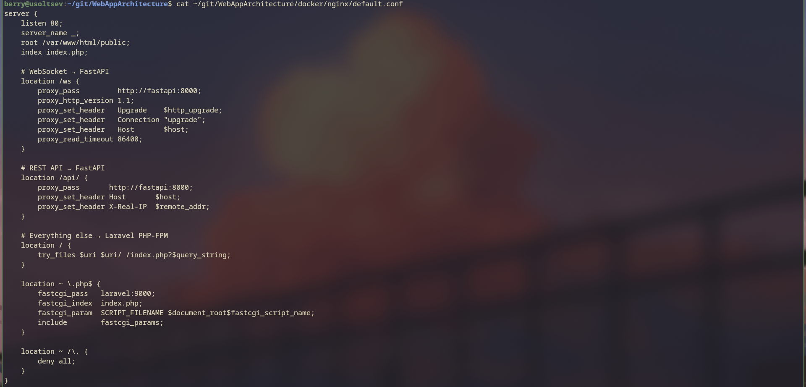

**Почему root указывает на public/, а не на корень Laravel? Что будет если указать на /?**

Если указать root на корень проекта, то `https://site.com/.env` вернёт файл с секретами, `https://site.com/vendor/autoload.php` — PHP-файл. Laravel намеренно выносит в `public/` только точку входа (`index.php`) и статику: весь остальной код, конфиги и ключи находятся за пределами публичного каталога и физически недоступны через веб. Это базовая мера безопасности веб-приложений.

---

## Задание 8. WebSocket proxy

В конфиге Nginx блок `location /ws` проксирует WebSocket-соединения на FastAPI с обязательными заголовками `Upgrade` и `Connection: upgrade`, а также `proxy_read_timeout 86400` для долгоживущих соединений.


**Почему WebSocket требует специального проксирования? Что произойдёт без заголовков Upgrade?**

HTTP — протокол запрос-ответ: соединение закрывается после ответа. WebSocket использует механизм HTTP Upgrade: клиент отправляет `Upgrade: websocket` → сервер отвечает `101 Switching Protocols` → соединение остаётся открытым для двустороннего обмена. Nginx по умолчанию не передаёт заголовок `Upgrade` в upstream. Без явного `proxy_set_header Upgrade $http_upgrade` и `Connection "upgrade"` Nginx обработает запрос как обычный HTTP и вернёт клиенту ответ 400 или 200, но не переключится в режим тоннеля — WebSocket просто не заработает.

---

# Часть В. Docker Compose

## Задание 9. Описание сервисов

В `docker-compose.yml` описаны пять сервисов: `nginx` (nginx:alpine), `laravel` (сборка из `./boardy-laravel`), `fastapi` (сборка из `./boardy-api`), `mysql` (mysql:8), `redis` (redis:7-alpine). Все в одной сети `boardy_net`.

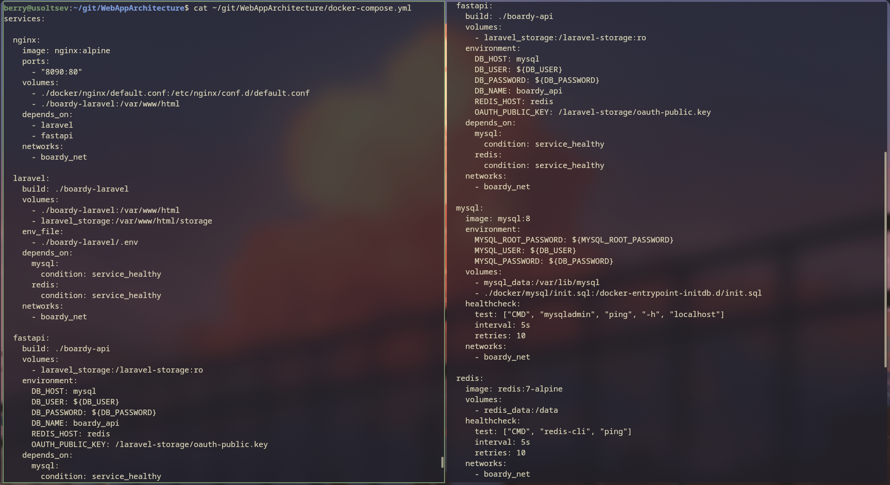

**Почему сервисы ссылаются друг на друга по имени (laravel:9000), а не по IP?**

IP-адреса контейнеров в Docker назначаются динамически при каждом запуске — они могут меняться. Docker Compose автоматически создаёт DNS-записи внутри сети: имя сервиса резолвится в текущий IP контейнера. Это делает конфигурацию стабильной и портируемой: `fastcgi_pass laravel:9000` будет работать независимо от того, какой IP получил контейнер Laravel при запуске. Использование IP напрямую было бы хрупким решением.

---

## Задание 10. Тома (volumes)

В `docker-compose.yml` объявлены три именованных тома: `mysql_data` (данные MySQL), `redis_data` (персистентность Redis), `laravel_storage` (хранилище Laravel + OAuth-ключи Passport). Том `laravel_storage` монтируется в Laravel как `/var/www/html/storage` и в FastAPI как `/laravel-storage:ro` — так Passport-ключи становятся доступны для проверки JWT без копирования файлов.


**Чем именованный том отличается от bind mount? Когда использовать каждый?**

**Bind mount** (`./boardy-laravel:/var/www/html`) монтирует конкретную директорию хоста в контейнер — код с хоста виден «вживую», изменения мгновенны. Подходит для разработки: правишь файл → сразу видишь результат без пересборки. Минус: зависит от структуры файловой системы хоста, не портируемо.

**Именованный том** (`mysql_data:/var/lib/mysql`) — абстракция Docker: Docker сам решает, где хранить данные (обычно `/var/lib/docker/volumes/`). Не зависит от структуры хоста, переносим между машинами (можно забэкапить и восстановить). Идеален для данных, которые должны переживать пересоздание контейнера: БД, ключи, загружаемые файлы.

---

## Задание 11. Healthcheck и depends_on

Для `mysql` и `redis` настроены `healthcheck` (команды `mysqladmin ping` и `redis-cli ping` с интервалом 5 с). Сервисы `laravel` и `fastapi` используют `depends_on` с `condition: service_healthy` — они стартуют только когда БД и кэш реально готовы принимать соединения.

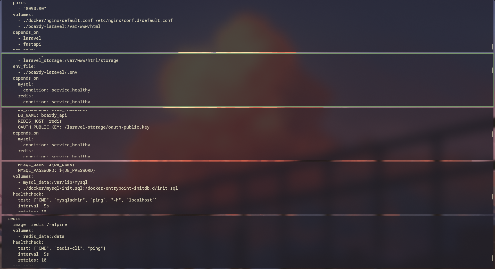

**Почему depends_on без condition: service_healthy не гарантирует порядок?**

`depends_on` без условия гарантирует только **порядок запуска контейнеров**, но не их готовность. MySQL может занять 5–10 секунд на инициализацию данных, создание системных таблиц и открытие сокета. За это время Laravel уже запустился, попытался подключиться к БД и получил `Connection refused`. Приложение падает или не может выполнить миграции. `condition: service_healthy` заставляет Docker Compose ждать, пока healthcheck не вернёт успех — то есть пока MySQL реально не начнёт отвечать на запросы. Это надёжный способ управлять порядком инициализации зависимых сервисов.

---

## Задание 12. init.sql — две базы данных

Файл `docker/mysql/init.sql` монтируется в `/docker-entrypoint-initdb.d/`. При первом запуске MySQL автоматически выполняет все `.sql`-файлы из этой директории. Скрипт создаёт `boardy_laravel` и `boardy_api` с кодировкой `utf8mb4`, даёт пользователю `boardy` права на обе базы.

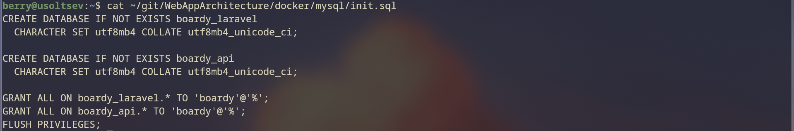

**Когда выполняется init.sql? Что будет при повторном запуске?**

`init.sql` выполняется **только один раз** — при первой инициализации тома `mysql_data` (когда директория данных MySQL пуста). Docker MySQL entrypoint проверяет: если `/var/lib/mysql` уже содержит данные, скрипты инициализации пропускаются. Это правильное поведение: миграции не будут повторно удалять и создавать базы при каждом `docker compose up`. При необходимости сбросить всё — `docker compose down -v` удаляет том и при следующем `up` init.sql выполнится снова.

---

# Часть Г. Конфигурация и секреты

## Задание 13. Переменные окружения в compose

FastAPI получает конфигурацию через `environment` в `docker-compose.yml`: `DB_HOST: mysql`, `DB_USER: ${DB_USER}`, `REDIS_HOST: redis`, `OAUTH_PUBLIC_KEY: /laravel-storage/oauth-public.key`. Значения `${DB_USER}` и `${DB_PASSWORD}` берутся из корневого `.env`.


**Чем переменные окружения лучше config-файлов внутри образа?**

Если зашить конфигурацию в образ (`COPY config.yaml .`), образ становится привязанным к конкретной среде: один образ для dev, другой для prod, третий для staging. Переменные окружения позволяют собрать образ один раз и запускать его с разными конфигурациями (разные хосты БД, разные пароли) — `docker run -e DB_HOST=prod-mysql ...`. Это соответствует принципу 12-Factor App: конфигурация отделена от кода, секреты не попадают в образ и в git.

---

## Задание 14. .env файл — секреты вне кода

Корневой `.env` содержит `MYSQL_ROOT_PASSWORD`, `DB_USER`, `DB_PASSWORD`. В git хранится только `.env.example` с placeholder-значениями. Реальный `.env` добавлен в `.gitignore`.


**Что произойдёт если закоммитить .env с паролями? Как исправить?**

Секрет в git — навсегда в истории: даже если удалить файл в следующем коммите, он остаётся доступен через `git log` и `git show`. Если репозиторий публичный или получит доступ злоумышленник — пароли скомпрометированы. Исправление: немедленно **сменить** все скомпрометированные пароли/токены (ротация), затем почистить историю через `git filter-repo` или BFG Repo Cleaner. Главное: сначала ротация, потом чистка — иначе злоумышленник успеет воспользоваться старыми секретами за то время, пока вы чистите историю.

---

## Задание 15. Laravel .env с именами контейнеров

`boardy-laravel/.env` содержит `DB_HOST=mysql`, `REDIS_HOST=redis` — имена сервисов из Docker Compose, которые резолвятся через встроенный DNS. `APP_URL=https://boardy.emrysdev.xyz`, `PASSPORT_SPA_CLIENT_ID` задан для рендеринга в Blade-шаблоны.


**Почему DB_HOST=mysql, а не 127.0.0.1? Что такое service discovery в Docker?**

`127.0.0.1` — loopback-адрес самого контейнера Laravel: MySQL там не запущен. MySQL работает в отдельном контейнере `mysql`. Docker Compose создаёт внутреннюю DNS-зону сети `boardy_net`: имя `mysql` резолвится в IP-адрес контейнера с этим именем. Это и есть service discovery — механизм, позволяющий сервисам находить друг друга по имени, а не по IP. Конфигурация не зависит от конкретных IP-адресов, которые могут меняться при каждом запуске.

---

# Часть Д. Первый запуск

## Задание 16. docker compose ps — все контейнеры Up

После `docker compose up -d` команда `docker compose ps` показывает все пять контейнеров в состоянии `running` (`Up`). MySQL и Redis дополнительно показывают `(healthy)`.


---

## Задание 17. Миграции и passport:install

После первого запуска выполнены:

```bash
docker compose exec laravel php artisan migrate
docker compose exec laravel php artisan passport:install
```

Миграции создали все таблицы Laravel (users, posts, sessions и т.д.) и таблицы Passport (oauth_clients, oauth_access_tokens и др.). `passport:install` сгенерировал ключи подписи в томе `laravel_storage` — они доступны FastAPI через тот же том (`/laravel-storage/oauth-public.key`).

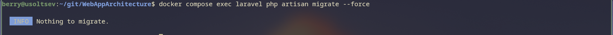
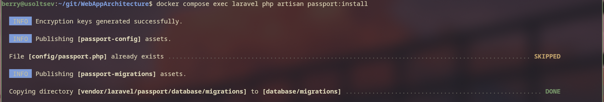

**Почему миграции не запускаются автоматически при старте контейнера?**

Автоматический запуск `php artisan migrate` при старте контейнера опасен в production: если два экземпляра приложения стартуют одновременно (например, при rolling deploy), они оба попытаются запустить миграции — возникнет race condition. Кроме того, деструктивные миграции (удаление колонок, изменение типов) могут затронуть данные неожиданно. В production миграции запускаются вручную или через CI/CD pipeline как явный, контролируемый шаг деплоя.

---

# Часть Е. Приложение работает

## Задание 18 (скр. 19). Главная страница и лента постов

Приложение доступно по адресу `https://boardy.emrysdev.xyz`. Лента постов загружается, навигация работает. Nginx отдаёт статику (`public/build/`) напрямую, PHP-запросы уходят в Laravel через FastCGI.


---

## Задание 19 (скр. 20). OAuth и создание комментария

Пользователь авторизован через GitHub OAuth (Laravel Socialite). Для доступа к FastAPI API используется PKCE flow: кнопка «Войти» инициирует `/oauth/authorize` → callback → обмен `code` на `access_token`. Комментарий успешно создан через React-компонент (`POST /api/posts/{id}/comments` с `Authorization: Bearer ...`).

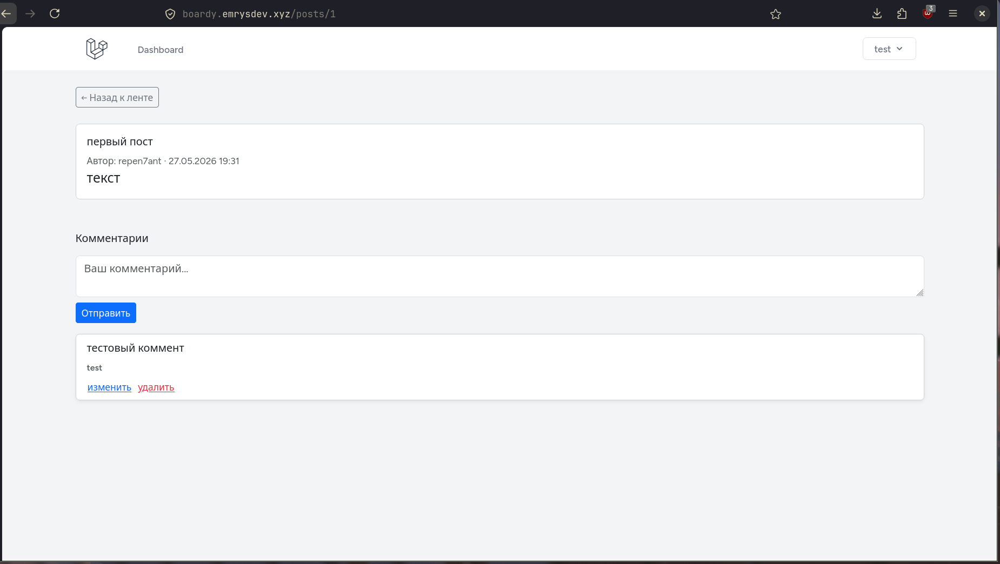

---

## Задание 20 (скр. 21–22). WebSocket: реалтайм

Новый комментарий через WebSocket транслируется всем подключённым клиентам без перезагрузки страницы: FastAPI при создании комментария вызывает `manager.broadcast()` — все активные WebSocket-соединения получают событие `new_comment`.


---

# Часть Ж. Persistence, логи, чистая машина

## Задание 18. Данные переживают перезапуск

После `docker compose down` и `docker compose up -d` все пользователи, посты и комментарии сохранились. Данные MySQL хранятся в именованном томе `mysql_data`, который `down` не удаляет — только останавливает и удаляет контейнеры.

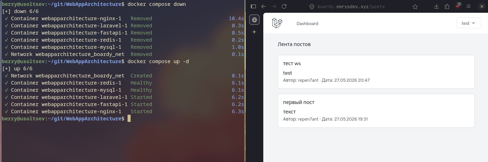

**Что произойдёт с данными при `docker compose down -v`? В чём опасность флага `-v`?**

`docker compose down -v` удаляет все именованные тома, объявленные в `docker-compose.yml`: `mysql_data`, `redis_data`, `laravel_storage`. Данные БД уничтожаются безвозвратно. Опасность `-v` в том, что флаг не спрашивает подтверждения и не предупреждает о потере данных. В production среде ошибочный `down -v` может уничтожить все данные приложения. Правило: `-v` используется только при осознанном сбросе окружения (например, при пересоздании схемы с нуля), а перед этим обязателен бэкап (`mysqldump`).

---

## Задание 19. Централизованные логи

`docker compose logs -f` показывает единый поток логов всех пяти сервисов с префиксом имени сервиса. `docker compose logs laravel` — только Laravel.

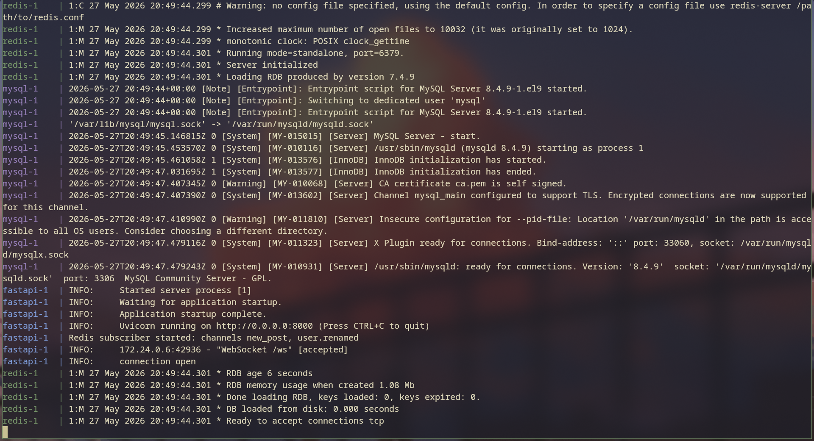

**Какие плюсы централизованных логов Docker по сравнению с `tail -f /var/log/*` на хосте?**

`tail -f /var/log/*` на хосте: нужно знать путь к каждому лог-файлу, логи разбросаны по разным директориям, нет метаданных об источнике, сложно объединить несколько потоков. Логи Docker централизованы по определению: все сервисы пишут в stdout/stderr, Docker собирает их с меткой времени и именем контейнера. `docker compose logs` объединяет потоки, корелляция событий между сервисами тривиальна — видно, что MySQL поднялся за 3 секунды до того, как Laravel начал принимать запросы. В production логи направляются в централизованные системы (Loki, ELK, CloudWatch) без изменения кода приложения — достаточно изменить log driver.

---

## Задание 20. Чистая машина

После `docker compose down -v`, удаления образов и повторного `docker compose up -d` стек запустился с нуля: Docker подтянул базовые образы, собрал кастомные образы, выполнил `init.sql` при старте MySQL. После `php artisan migrate` и `passport:install` приложение полностью работоспособно.

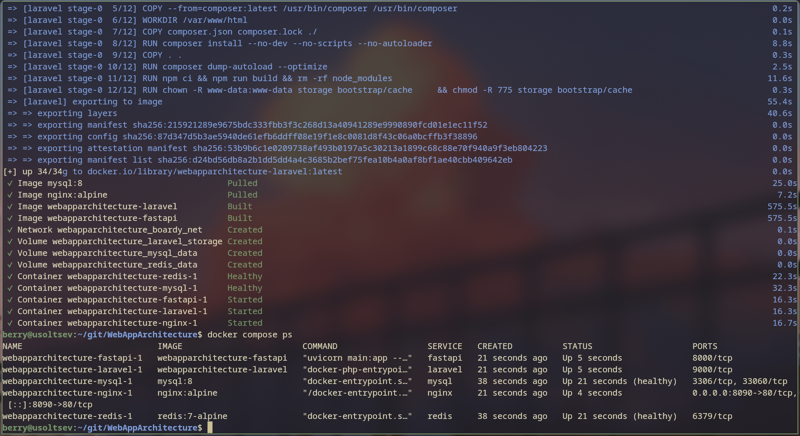

**Какая команда нужна на новой машине от клона репозитория до рабочего приложения?**

```bash
git clone <repo-url>
cd WebAppArchitecture
cp .env.example .env          # заполнить реальными значениями
cp boardy-laravel/.env.example boardy-laravel/.env  # заполнить APP_KEY, DB, Passport и т.д.
docker compose up -d --build
docker compose exec laravel php artisan migrate
docker compose exec laravel php artisan passport:install
docker compose exec laravel php artisan passport:client --public --name="Boardy SPA" --redirect_uri="https://your-domain/oauth/callback"
```

Итого: `git clone` + настройка двух `.env` + три команды artisan. Всё остальное (установка PHP, Python, MySQL, Redis, Nginx, зависимостей) выполняется автоматически Docker Compose. Это и есть главная ценность контейнеризации: «работает на моей машине» превращается в «работает на любой машине с Docker».
