# Часть A. CI: проверки на каждый PR

## Задание 1. Скелет workflow

Создан `.github/workflows/ci.yml` с триггерами на `pull_request` (ветки master) и `push` (ветки master, dev). Workflow появился во вкладке Actions сразу после пуша.

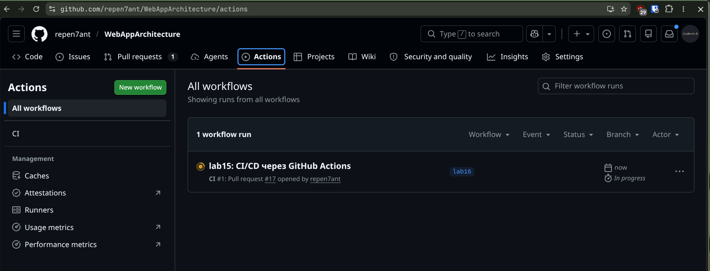

---

## Задание 2. Lint

Job `lint` содержит два шага: `find boardy-laravel -name "*.php" -print0 | xargs -0 -n1 php -l` и `python -m compileall boardy-api/ -q`. Оба инструмента встроены в язык — никаких зависимостей устанавливать не нужно.

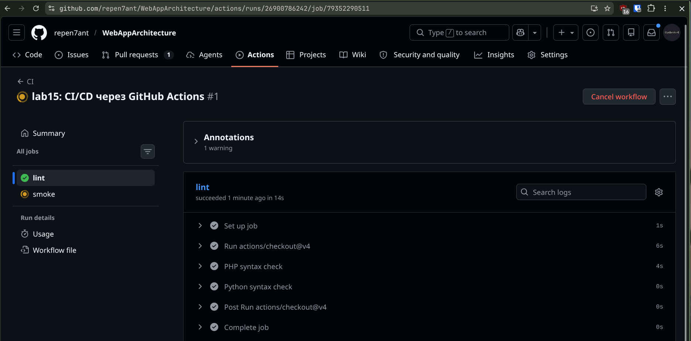

**Почему lint стоит первым в пайплайне? Что он ловит, а что нет?**

Lint — самая быстрая проверка: она не требует ни зависимостей, ни поднятия сервисов. Принцип fail fast: если код вообще не парсится, запускать сборку и тесты бессмысленно — они всё равно упадут, но потратят больше времени. Lint стоит первым, чтобы немедленно отклонить очевидно сломанный коммит.

Что ловит: синтаксические ошибки (незакрытые скобки, некорректные операторы), неверный синтаксис импортов в Python (`compileall` проверяет байт-компиляцию). Что **не** ловит: логические ошибки, неправильную бизнес-логику, ошибки типов, несуществующие методы — всё это проверяют тесты.

---

## Задание 3. /health эндпоинты

В `boardy-laravel/routes/web.php` добавлен маршрут:
```php
Route::get('/health', fn () => response()->json(['ok' => true]))->withoutMiddleware(['web']);
```

В `boardy-api/main.py`:
```python
@app.get("/api/health")
def health():
    return {"ok": True}
```

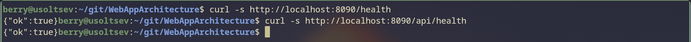

**Зачем отдельный /health, если есть полноценные эндпоинты? Где используется в проде?**

Полноценные эндпоинты требуют авторизации, затрагивают БД, могут зависеть от внешних сервисов — они не подходят для быстрой проверки «жив ли процесс». `/health` — это минимальный эндпоинт без логики и зависимостей: отвечает `200 OK` если сервис запущен и принимает запросы.

В продакшене такие эндпоинты используются повсеместно: Kubernetes liveness/readiness probes дёргают `/health` каждые несколько секунд и перезапускают Pod если он не отвечает; load balancer исключает инстанс из ротации при `!= 200`; мониторинг (Uptime Robot, Datadog) проверяет доступность сервиса. Это индустриальный стандарт.

---

## Задание 4. Smoke-check

Job `smoke` с `needs: lint` собирает образы через `docker compose build`, поднимает стек, ждёт ответа от `/health` в цикле (до 30 итераций по 2 секунды), затем делает `curl -f` к обоим эндпоинтам. В конце `docker compose down -v` с `if: always()`.

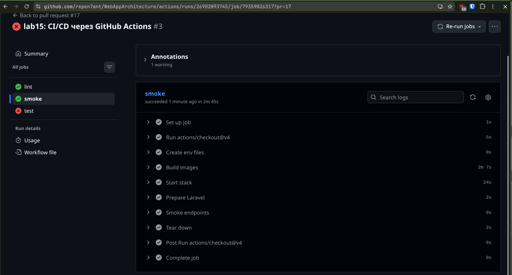

**Какие три класса поломок ловит smoke? Что он НЕ ловит?**

1. **Сборка** — образ не собирается (синтаксическая ошибка в Dockerfile, отсутствующая зависимость, несовместимость версий).
2. **Запуск** — сервисы не стартуют (неправильный compose, сервисы не видят друг друга, БД не поднимается).
3. **Доступность** — приложение стартует, но `curl /health` возвращает не 200 (битая конфигурация nginx, приложение падает при старте).

Что **не** ловит: бизнес-логику, корректность API-ответов, права доступа, производительность, race conditions — для этого нужны полноценные тесты.

---

# Часть B. Минимальные тесты и блокировка

## Задание 5. PHPUnit-тест на /health

Создан `boardy-laravel/tests/Feature/HealthTest.php`. `$this->get('/health')` поднимает приложение в памяти через Laravel HTTP-клиент — реальный сервер не нужен. `assertStatus(200)` и `assertJson(['ok' => true])` проверяют ответ. Если проверка не сходится — phpunit завершается с кодом 1.

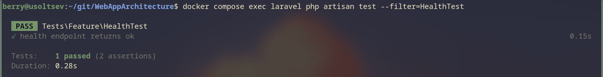

---

## Задание 6. pytest-тест на /health

Создан `boardy-api/tests/test_health.py`. `TestClient` от FastAPI поднимает приложение в памяти без uvicorn. `assert response.status_code == 200` и `assert response.json() == {"ok": True}` — стандартный pytest: провал assert → код выхода 1.

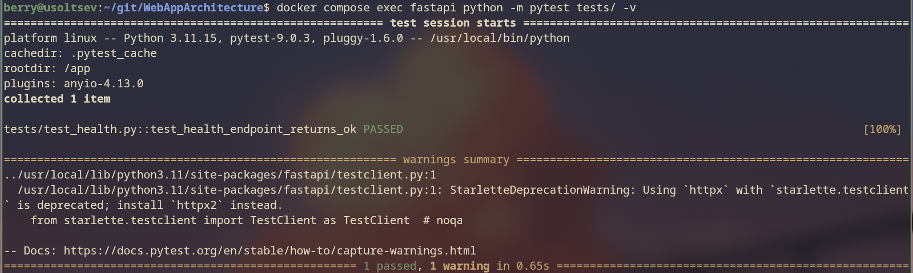

---

## Задание 7. Job test в CI

Job `test` с `needs: smoke`: сначала устанавливается PHP 8.3 + composer, запускается `php artisan test --filter=HealthTest`. Затем Python 3.11 + pip, запускается `pytest -v`. Если любой из них упал — весь job failed, последующие jobs не запускаются.

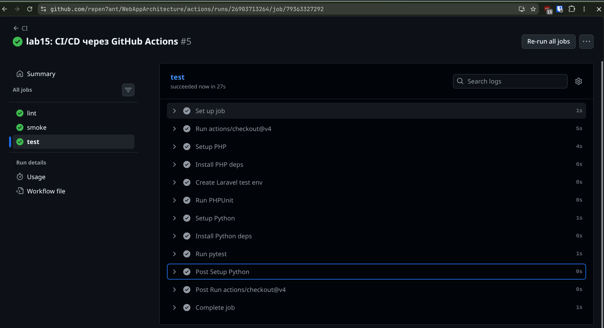

**Почему test после smoke, а не до? Что было бы наоборот?**

`smoke` проверяет что образы собираются и стек поднимается — это предусловие для осмысленных тестов. Если стек не поднимается, тесты всё равно упадут (или пройдут некорректно на заглушках). Порядок `lint → smoke → test` соответствует принципу fail fast: сначала дешёвые проверки, потом дорогие.

Если бы тесты шли до smoke: тесты могут пройти (они запускают приложение в памяти, без реального compose), но smoke падёт — и мы потратили время на тесты зря. Хуже — если smoke занимает 5 минут, а тесты 30 секунд, мы бы долго ждали результата при битом compose.

---

## Задание 8. Блокировка сборки сломанным тестом

В `test_health.py` временно изменён assert: `assert response.status_code == 999`. После пуша job `test` упал с красным крестом, jobs `build` и `deploy` остались серыми (skipped). PR показал «All checks have failed».

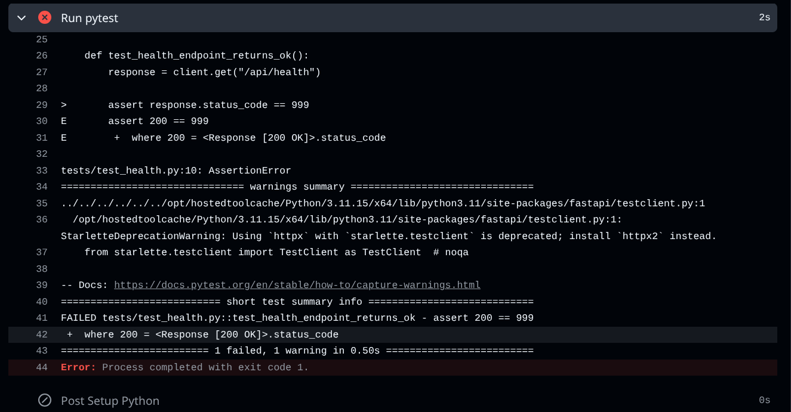
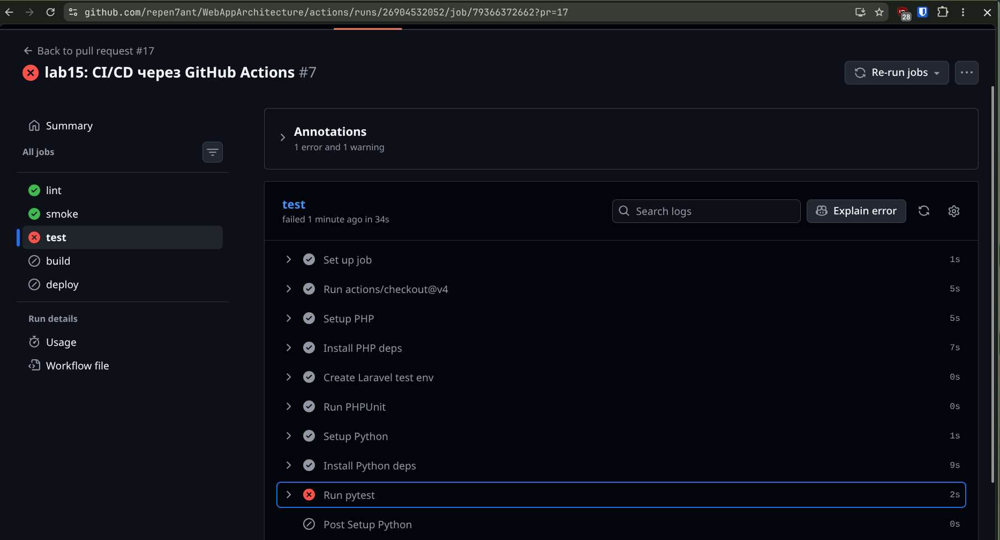
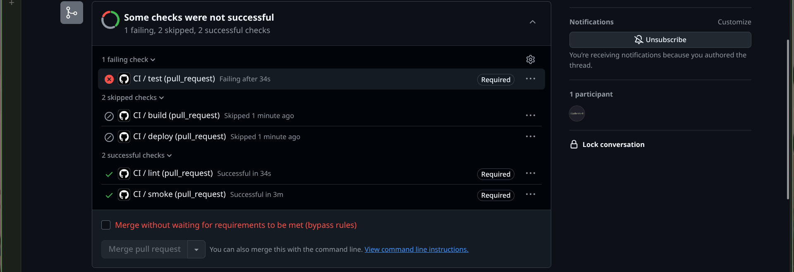

**Опишите цепочку: что бы случилось при ручном деплое? Сколько времени сэкономил CI?**

Без CI: разработчик пушит сломанный код → делает `git pull` на сервере → `docker compose up --build` → приложение поднимается, но тест обнаруживает баг уже в проде. Пользователи видят поломку. Разработчик ищет причину: смотрит логи, сравнивает коммиты, откатывается вручную. Типичное время обнаружения + фикса: 15–60 минут, плюс downtime.

С CI: сломанный коммит → GitHub Actions красный крест через 2–3 минуты → merge заблокирован → на прод ничего не уехало → разработчик видит конкретную строку упавшего assert → фикс за 1 минуту. Сэкономлено: потенциальный инцидент в проде, откат, поиск причины.

---

## Задание 9. Где смотреть логи

Шаги для поиска упавшего теста:

1. Открыть вкладку **Actions** на GitHub → найти запуск с красным крестом (иконка ✗).
2. Кликнуть на название запуска → откроется граф jobs → найти job с красным крестом (например, `test`).
3. Кликнуть на job → развернётся список steps → найти step с красным крестом (например, `Run pytest`).
4. Кликнуть на step → развернётся вывод команды → в выводе pytest будет строка `AssertionError: assert 200 == 999` с указанием файла и номера строки.

---

## Задание 10. Защита ветки master

В Settings → Branches добавлено правило для `master`: требуется прохождение status checks `lint`, `smoke`, `test` и обязательный PR перед мержем.

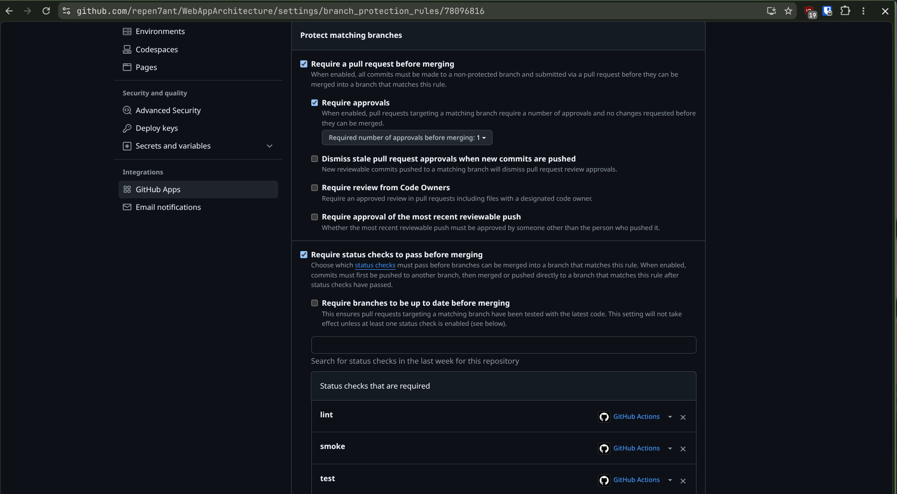

---

# Часть C. Сборка и реестр

## Задание 11. Workflow деплоя

Создан `.github/workflows/deploy.yml` с триггером `push: branches: [master]`. Внутри повторены jobs `lint`, `smoke`, `test`, затем `build` и `deploy`.

**Почему сборка и деплой в отдельном файле? Зачем повтор lint/smoke/test в deploy.yml?**

Разделение по файлам — разделение ответственности: `ci.yml` отвечает за проверку каждого PR (быстрая обратная связь), `deploy.yml` — за доставку в прод (запускается только на `master`). Объединять нецелесообразно: нет смысла запускать сборку и деплой на каждом PR в feature-ветку.

Повтор `lint/smoke/test` в `deploy.yml` нужен потому, что кто-то может запушить напрямую в `master`, обойдя PR-процесс (force push, merge через API). Без повтора сломанный код попадёт в прод без проверок. Принцип: защищай прод независимо от того, как туда пришли изменения.

---

## Задание 12. Login в GHCR

Job `build-and-push` использует `docker/login-action@v3` с `secrets.GITHUB_TOKEN` — автоматический токен, создаётся GitHub на каждый запуск.

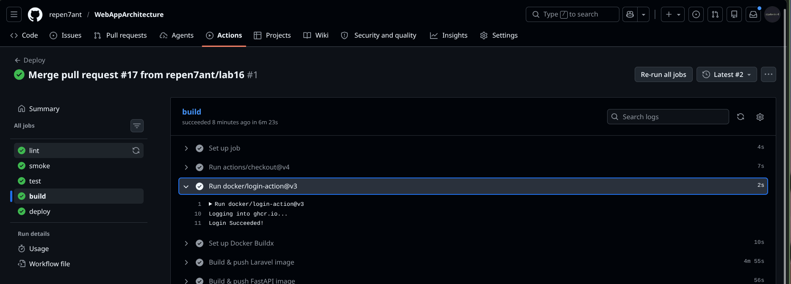

**Что такое GITHUB_TOKEN? Чем отличается от обычного secret-а?**

`GITHUB_TOKEN` — временный токен, который GitHub Actions автоматически создаёт в начале каждого запуска и уничтожает по его завершении. Он не требует ручного создания и не имеет срока истечения как постоянный секрет.

Два ключевых отличия от обычного secret:
1. **Срок жизни**: `GITHUB_TOKEN` живёт только во время одного запуска (максимум 24 часа), обычный PAT-секрет — до истечения или отзыва. Скомпрометированный `GITHUB_TOKEN` автоматически становится бесполезным.
2. **Область действия**: `GITHUB_TOKEN` ограничен одним репозиторием и только теми permissions, которые явно указаны в workflow (`packages: write`). Обычный PAT можно выдать с доступом ко всем репозиториям аккаунта.

---

## Задание 13. Сборка и push образов

Два образа собраны и запушены в GHCR через `docker/build-push-action@v6` с платформой `linux/arm64`. Каждый образ имеет два тега.

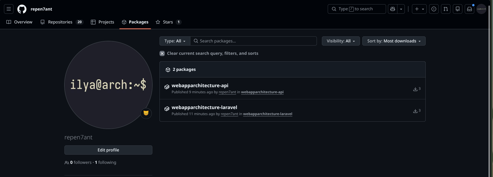

**Зачем два тега? Когда какой используется?**

`github.sha` (например, `abc1234...`) — тег привязан к конкретному коммиту. По нему всегда можно воспроизвести точно какой код был в образе и откатиться на конкретную версию: `docker pull ghcr.io/.../laravel:abc1234`. Идеален для аудита и роллбека.

`latest` — всегда указывает на самый свежий образ. Используется для удобства при первом деплое и в `docker compose pull` на сервере: не нужно знать конкретный SHA, всегда тянется актуальная версия. Минус: нет гарантии идемпотентности — `latest` сегодня и `latest` завтра могут быть разными образами.

---

# Часть D. Автодеплой и полный прогон

## Задание 14. Compose тянет из GHCR

В `docker-compose.yml` для сервисов `laravel` и `fastapi` добавлены поля `image: ghcr.io/repen7ant/webapparchitecture-laravel:latest` и `image: ghcr.io/repen7ant/webapparchitecture-api:latest` рядом с `build:`. Создан `docker-compose.local.yml` для локальной разработки (override с `build:` и `image: ''`).

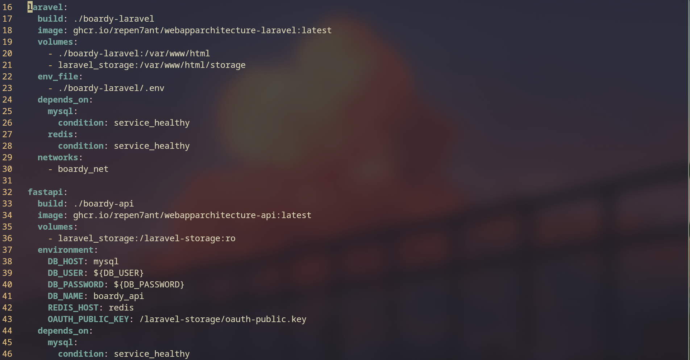

**Сравните с compose из практики 15. Почему сборка ушла из сервера?**

В практике 15: `build: ./boardy-laravel` — сервер сам собирал образ из исходников. Это требовало наличия исходного кода, Node.js, PHP, composer на сервере. Каждый деплой = пересборка = несколько минут downtime или риск поломки при сборке прямо на проде.

В практике 16: `image: ghcr.io/...` — сервер только скачивает готовый образ. Образ уже проверен CI (lint + smoke + test), собран на мощном runner-е, гарантированно рабочий. Сервер делает только `docker compose pull && up` — это секунды. Принцип: сервер не место для сборки, он место для запуска.

---

## Задание 15. SSH-ключ деплоя и секреты

Сгенерирован отдельный ключ `github_actions` (`ssh-keygen -t ed25519`). Публичная часть добавлена в `~/.ssh/authorized_keys` на сервере. Приватная часть — в GitHub Secret `SSH_PRIVATE_KEY`. Также добавлены секреты `TAILSCALE_SERVER_HOST`, `SERVER_USER`, `SERVER_PATH`, `GHCR_TOKEN`, `TAILSCALE_AUTHKEY`.

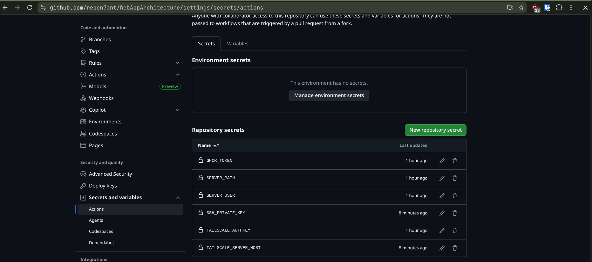

**Почему отдельный ключ для деплоя, а не личный? Что делать если он утечёт?**

Личный SSH-ключ даёт доступ ко всем серверам, где он авторизован. Если его поместить в GitHub Secrets и он утечёт (компрометация runner-а, логи), злоумышленник получит доступ ко всей инфраструктуре.

Отдельный ключ для деплоя: область доступа ограничена одним сервером и одним пользователем. При утечке — немедленно удалить публичный ключ из `authorized_keys` на сервере (`sed -i '/github_actions/d' ~/.ssh/authorized_keys`), сгенерировать новую пару, обновить GitHub Secret. Личный доступ при этом не затронут.

---

## Задание 16. Job deploy

Job `deploy` с `needs: build-and-push` подключается к серверу через Tailscale VPN (`tailscale/github-action@v2`), затем через SSH (`appleboy/ssh-action@v1`) выполняет `docker compose pull && docker compose up -d && docker image prune -f`.

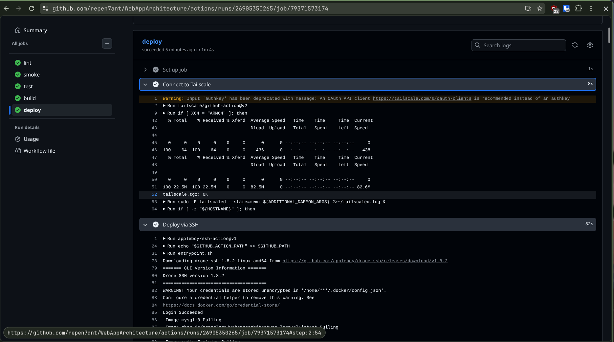

---

## Задание 17. Полный pipeline

После мержа PR в master запустился `deploy.yml`: все 5 jobs прошли зелёными. Сайт обновился автоматически — без единой ручной команды на сервере.

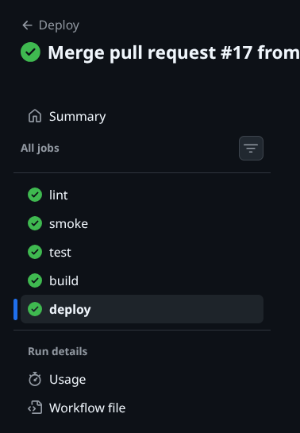
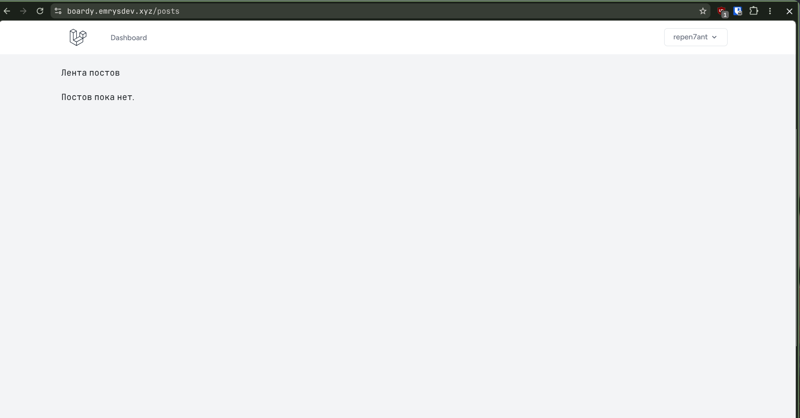

---

## Задание 18. Откат

Чтобы откатиться на предыдущую версию по SHA-тегу, на сервере:

```bash
cd ~/git/WebAppArchitecture
# Найти нужный SHA из тегов образа в GHCR или git log
docker compose pull  # необязательно если образ уже есть локально
docker image ls | grep webapparchitecture-laravel  # найти нужный тег

# Временно переопределить образ и перезапустить
IMAGE_TAG=<sha> docker compose up -d
```

Или через `docker-compose.override.yml`:
```yaml
services:
  laravel:
    image: ghcr.io/repen7ant/webapparchitecture-laravel:<sha>
  fastapi:
    image: ghcr.io/repen7ant/webapparchitecture-api:<sha>
```

**Почему не нужно ничего пересобирать?**

Образ с тегом по SHA уже хранится в GHCR — он был собран и проверен в момент того коммита. Откат — это просто `docker compose pull` с другим тегом и `up -d`. Пересборки нет: образ уже готов, подписан, проверен. Именно для этого существует тег по SHA — не для отображения, а для воспроизводимости и роллбека.

---

## Задание 19. Безопасность пайплайна

**(1) Почему версию стороннего action лучше пинить по SHA, а не по тегу?**

Тег (`actions/checkout@v4`) мутабелен — владелец репозитория может перезаписать его в любой момент, подменив код action. Если злоумышленник скомпрометирует аккаунт владельца, он сможет изменить `v4` на вредоносный код, и все пайплайны, использующие этот тег, выполнят его с вашими секретами. SHA коммита (`actions/checkout@11bd71901bbe5b1630ceea73d27597364c9af683`) иммутабелен — такой action нельзя подменить без изменения хэша.

**(2) Что произойдёт если запустить недоверенный код в pull_request_target?**

`pull_request_target` запускается в контексте целевой ветки (master) и имеет доступ к секретам репозитория. Если workflow использует код из PR (`actions/checkout@v4` с `ref: ${{ github.event.pull_request.head.sha }}`), злоумышленник может создать PR с вредоносным кодом, который прочитает `secrets.SSH_PRIVATE_KEY`, `secrets.GHCR_TOKEN` и отправит их на внешний сервер. Это называется script injection через pull request. Именно поэтому `pull_request` (без суффикса `_target`) не имеет доступа к секретам форков.

**(3) Почему для публичного репозитория опасен self-hosted runner?**

В публичном репозитории любой пользователь может создать форк и открыть PR. GitHub Actions запустит workflow на self-hosted runner-е в вашей инфраструктуре. Вредоносный PR может выполнить произвольные команды на вашем сервере: прочитать файлы, установить malware, получить доступ к внутренней сети. GitHub-hosted runner-ы изолированы и уничтожаются после каждого запуска — self-hosted остаётся с постоянным состоянием и сетевым доступом.

---

## Задание 20. Карта курса — путь проекта Boardy

| Практика | Боль которую решила |
|----------|---------------------|
| 1 | Нет единой точки входа — добавлен Laravel, структура MVC, роутинг |
| 2 | Нет хранилища данных — подключён MySQL, Eloquent ORM, миграции |
| 3 | Нет аутентификации — добавлен Laravel Breeze, сессии, защита роутов |
| 4 | Нет API для фронтенда — добавлен REST API для постов и комментариев |
| 5 | Монолит не масштабируется — выделен FastAPI как отдельный сервис для комментариев |
| 6 | Комментарии не в реальном времени — добавлены WebSocket через FastAPI |
| 7 | Нет OAuth для внешних клиентов — установлен Laravel Passport, выдача токенов |
| 8 | SPA не может безопасно получить токен — реализован PKCE flow в браузере |
| 9 | FastAPI не проверяет токены — добавлена RS256-валидация JWT через публичный ключ |
| 10 | Нет социальной авторизации — подключён GitHub OAuth через Laravel Socialite |
| 11 | Refresh token небезопасно хранится — перенесён в HttpOnly cookie |
| 12 | Нет pub/sub между сервисами — добавлен Redis как брокер событий |
| 13 | Laravel и FastAPI связаны HTTP-вызовами — заменены на Redis Pub/Sub |
| 14 | Развёртывание вручную, окружения расходятся — упакован в Docker Compose |
| 15 | Нет автоматических проверок, деплой ненадёжен — добавлен CI/CD с GitHub Actions |
